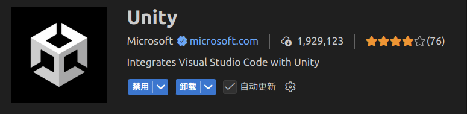
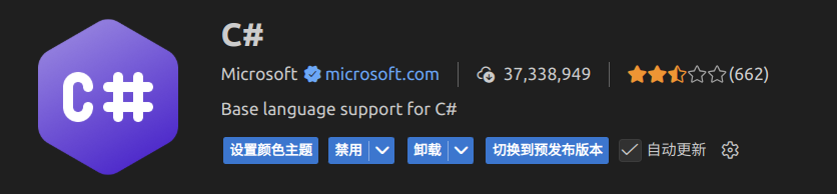
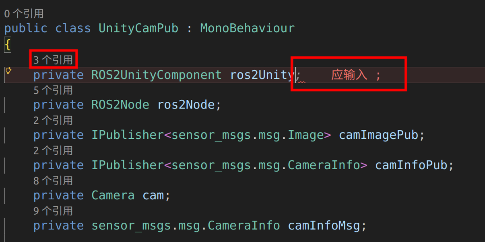

# rm软件组

26赛季起，Robomaster鼓励制作自定义客户端，rm软件组开发自定义客户端，要设计更多客制化功能和UI，以提高操作手对战场的把控能力。

目标：

- **自定义客户端** ( ⭐⭐⭐ )

    1. 到在联盟赛的时候能做出一版只为test的demo版，目的只是测试赛场环境下的网络交互。
    2. 到分区赛或者明年正式上线自定义客户端

    > 上场可以通过与官方电脑连接网线共享ip地址的形式，让操作手携带的装有自定义客户端的电脑也能连接上裁判系统(规则是否允许，有待商榷)

- **视觉仿真软件** ( ⭐⭐ )

    1. 为能量机关和雷达站提供仿真视频

# 快速开始

只学习一个开发工具，一种语言，快速上手客户端开发

## 环境配置

### Unity配置

- **windows**

    windows安装比较简单，unity适配也比较好，**较推荐**，适合新手。

    如果你不喜欢windows做开发，使用ubuntu也是可以的。

- **ubuntu**

    1. 按顺序安装好unityhub，安装好Unity 2022.3 LTS(2022.3.62f3) Editor, 注册好unity账户，添加Personal License

    2. 安装一个unity的linux补丁工具，解决引擎卡顿问题。
        ```bash
        sudo apt-get install unity-tweak-tool
        ```

        > 如果依然卡顿，检查nvidia-smi显示的功率，查看unity是否使用显卡。

    3. 打开引擎新建一个项目，选择 Edit->Preferences->External Tools->External Scripts Editor，选成你想要的vscode编辑器


### C# 配置

1. 安装 .NET SDK
    ```bash
    sudo apt install dotnet-sdk-8.0
    ```

2. 检查net版本
    ```bash
    dotnet --version # 检查版本
    ```

### Vscode 配置

安装3个插件即可





等待vscode输出框安装完所有环境后打开代码，检查是否有代码补全提示和语法报错提醒，有即为正常




## 制作第一款2D平台跳跃游戏

推荐学习B站up主 **秦无邪OvO** 的入门开发课程

我的开源: https://github.com/riyuexingchennnn/Unity_demo

重点关注：

- unity 引擎使用
- C#代码编写
- UGUI

> 如果你有良好的编程习惯和基础，unity引擎对你而言，就是一个玩具

## Mock调试

目前收集的开源有:

- [RM2026][江南大学霞客湾校区]自定义客户端模拟数据发送&MQTT可视化数据面板开源 https://bbs.robomaster.com/article/1296480?source=1

- RMMock-自定义客户端协议的第三方后端实现开源https://bbs.robomaster.com/article/1296451
代码：https://github.com/stydxm/RMMock

可以先使用开源，然后在此基础上逐步建立我们自己的rm_mock仓库