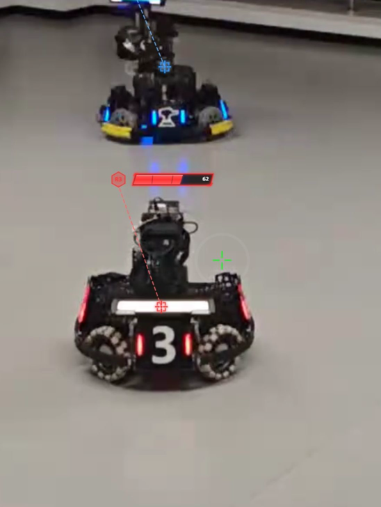
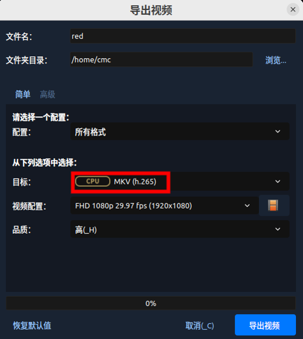
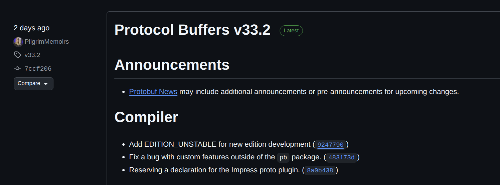
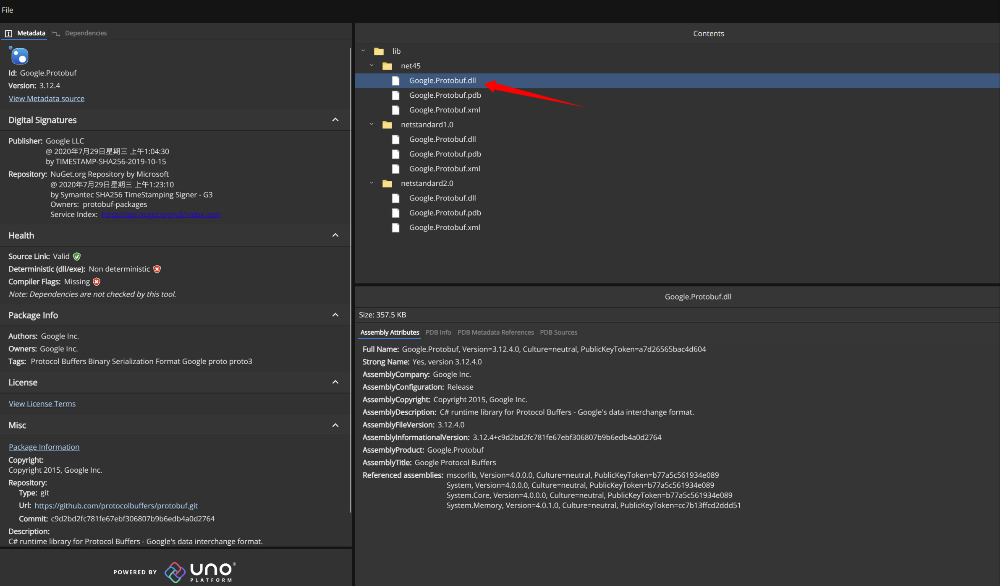
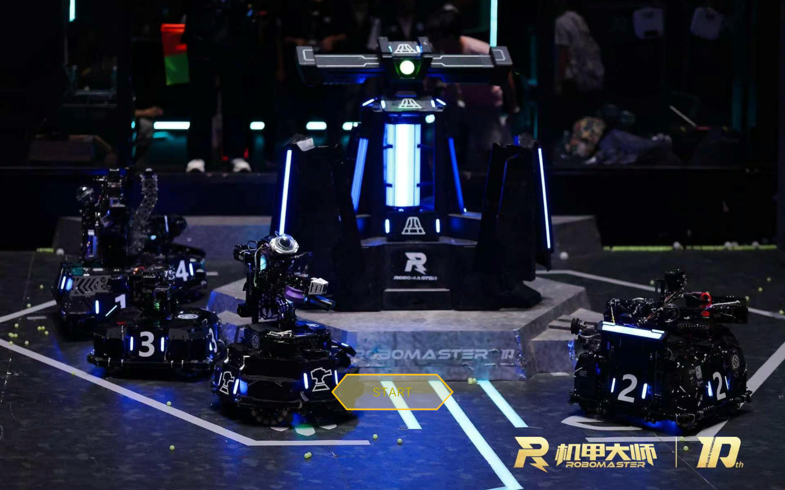
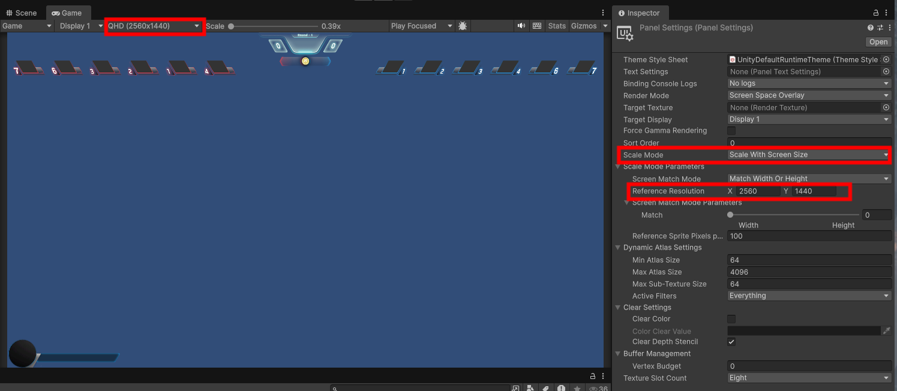
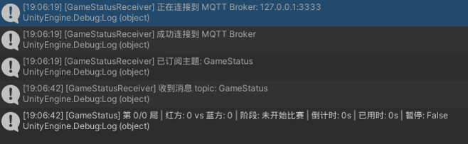
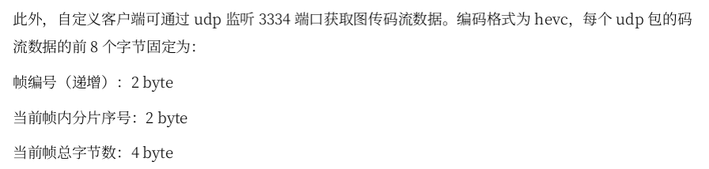
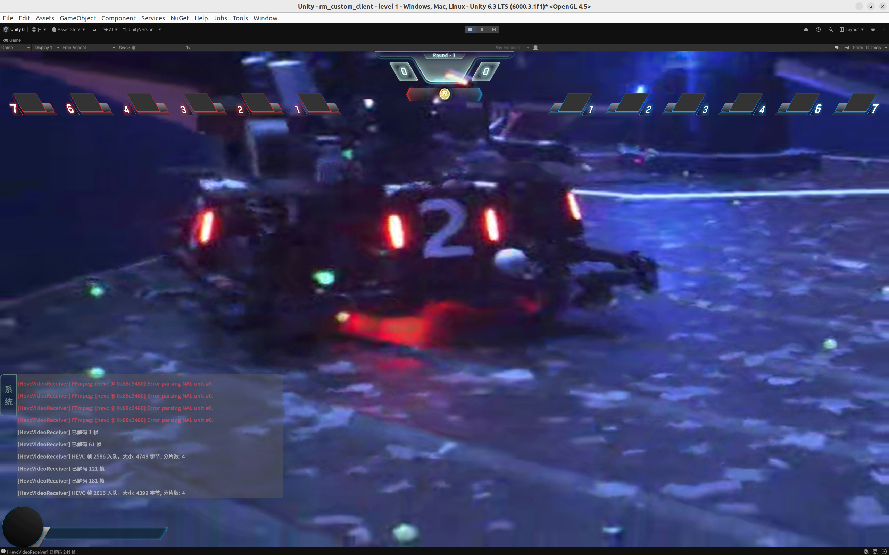
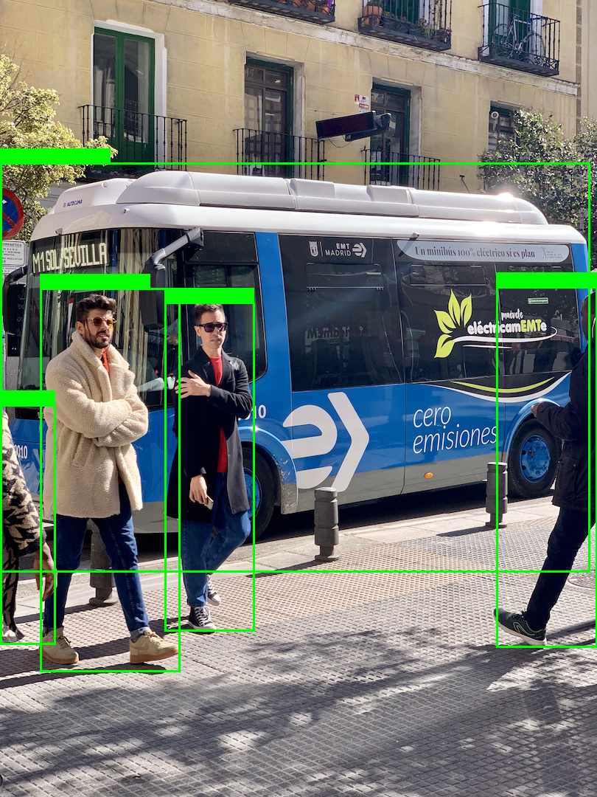

# rm软件组

26赛季起，Robomaster鼓励制作自定义客户端，rm软件组开发自定义客户端，要设计更多客制化功能和UI，以提高操作手对战场的把控能力。

## 我们的任务

- **自定义客户端** ( ⭐⭐⭐ )

    1. 到在联盟赛的时候能做出一版只为test的demo版，目的只是测试赛场环境下的网络交互。
    2. 到分区赛或者明年正式上线自定义客户端

    > 上场可以通过与官方电脑连接网线共享ip地址的形式，让操作手携带的装有自定义客户端的电脑也能连接上裁判系统(规则是否允许，有待商榷)

- **视觉仿真软件** ( ⭐⭐ )

    1. 为能量机关和雷达站提供仿真视频
    2. 为自瞄提供仿真环境

    

    

    我的开源：https://fyt-vision.coding.net/p/fyt2025/d/rm_unity/git

    rv仿真开源：https://gitlab.com/rm_vision/rm_vision_simulator

## 自定义客户端要有多自定义

1. **上方显示敌方机器人血量** ( ⭐⭐⭐ )

   - 方案一：使用yolo算法对图传帧处理，识别敌方机器人，在上方绘制血量UI
   - 方案二：利用视觉计算的敌方机器人位置透视变换到图传视角，在上方绘制血量UI

    

2. **超级赛场回放** ( ⭐⭐⭐ )

    自定义客户端不仅要录制操作手图传画面，还要录制实时赛场的各种状态信息、机器人信息，还要按照视频帧**录制操作手鼠标键盘事件**，以便操作手复盘


# 什么人推荐加入rm软件组

1. 计算机or软工专业，想学习计算机客户端软件设计的原理，了解网络请求，业务处理的流程。
2. 准备找工作的同学，此项目完全对标dji的rm专招通道的客户端开发岗位，并且提供转正机会，机不可失。

    

3. 学习过unity游戏开发的，做过Android Studio项目或者开发过某种客户端的同学。

# 快速开始

只学习一个开发工具，一种语言，快速上手客户端开发

## 环境配置

### Unity配置

[Unity6.3LTS官方文档](https://docs.unity3d.com/6000.3/Documentation/Manual/first-time-user.html)

- **windows**

    windows安装比较简单，unity适配也比较好，**较推荐**，适合新手。

    如果你不喜欢windows做开发，使用ubuntu也是可以的。

- **ubuntu**

    1. 按顺序安装好unityhub，安装好Unity6.3 LTS(6000.3.1f1) Editor, 注册好unity账户，添加Personal License

        > 如果在下载unity编辑器的时候出现了`下载失败: Validation Failed`，检查clash有没有开TUN虚拟网卡模式

    2. 安装一个unity的linux补丁工具，解决引擎卡顿问题。
        ```bash
        sudo apt-get install unity-tweak-tool
        ```

        > 如果依然卡顿，检查nvidia-smi显示的功率，查看unity是否使用显卡。

    3. 打开引擎新建一个项目，选择 Edit->Preferences->External Tools->External Scripts Editor，选成你想要的vscode编辑器


### Vscode 配置

安装3个插件即可


打开unity项目和对应的vscode代码，等待vscode输出框安装完所有环境后打开代码，检查是否有代码补全提示和语法报错提醒，有即为正常


## 制作第一款2D平台跳跃游戏

推荐学习B站up主 **秦无邪OvO** 的入门开发课程

我的开源: https://github.com/riyuexingchennnn/Unity_demo

重点关注：

- unity 引擎使用
- C# 代码编写
- UGUI
- Input System

少量关注：

- ShaderGraph
- Animator

> 如果你有良好的编程习惯和基础，unity引擎对你而言，就和玩具差不多

## Mock调试

目前收集的开源有:

- [RM2026][江南大学霞客湾校区]自定义客户端模拟数据发送&MQTT可视化数据面板开源 https://bbs.robomaster.com/article/1296480?source=1

- RMMock-自定义客户端协议的第三方后端实现开源https://bbs.robomaster.com/article/1296451
代码：https://github.com/stydxm/RMMock

可以先使用开源，推荐使用第一个，然后在此基础上逐步建立我们自己的rm_mock仓库

### SharkDataSever开源

> 如果你很熟悉Vue，你可以不用采取我的方法，直接跳过此部分教学

1. 使用鱼香ROS一键安装，选择 数字6 NodeJS环境
    ```bash
    wget http://fishros.com/install -O fishros && . fishros
    ```
    然后使用`node --version`查看nodejs版本，我的版本是`v18.20.8`

    如何使用和我一样的版本？安装node版本管理工具nvm，安装18选择18

2. 然后依次安装cnpm、pnpm

    ```bash
    npm install -g cnpm --registry=https://registry.npmmirror.com
    cnpm install -g pnpm
    ```

3. 安装，运行mqtt可视化Vue界面

    ```bash
    pnpm install
    pnpm run mqtt-visual
    ```

4. 运行图传视频流

    将目标视频文件通过`openshot`转成h265格式的视频，播放更流畅，帧率稳定。放入VideoSource文件夹中。

    

    ```bash
    pnpm run udp
    ```

## Protocol Buffers 入门

官方文档是最好的学习资料：https://protobuf.com.cn/overview/

1. 检查自己电脑的proto编译器的版本

    ```
    sudo apt install -y protobuf-compiler
    protoc --version
    ```

    如果你的电脑显示的版本为`libprotoc 3.12.4`。请注意这是非常老的版本，这个通常是由apt安装的，可以选择安装新版本protoc(旧的可以不用卸载)

2. 安装最新的protoc (⚠️实测**不推荐**，unity不支持新版)

    https://github.com/protocolbuffers/protobuf/releases

    

    解压后复制到/user/local目录中去

    ```bash
    sudo cp bin/protoc /usr/local/bin/
    sudo cp -r include/* /usr/local/include/
    ```

    > /usr/local/bin 的优先级高于 /usr/bin
    所以你的系统会自动使用新的 protoc

    再次检查版本，就可以看到`libprotoc 33.2`

    ⚠️ 注意：不推荐使用export路径的方式加到bashrc里去，因为这只对shell环境有用，容易出其他问题。

3. Protocol Buffer 基础：C#

    [官方文档](https://protobuf.com.cn/getting-started/csharptutorial/)

    下载我整理的proto文件<a href="/files/rm_messages.proto" download="rm_messages.proto">rm_messages.proto</a>

    运行下面指令，会得到一个RmMessages.cs的文件
    ```bash
    protoc --csharp_out=. rm_messages.proto
    ```

## Unity 与 mqtt protobuf

刚刚导入的RmMessages.cs会遇到一个Google.Protobuf依赖不匹配的问题，推荐到Nuget上下载对应3.12.4版本的dll库(选用老版本保证兼容性)

### 方法一：使用Nuget包管理工具安装dll库 (⭐推荐)

1. unity安装Nuget包管理工具

   - 先到这个链接下载最新的**unitypackage**文件 https://github.com/GlitchEnzo/NuGetForUnity/releases 拖入unity中import
   - 重启unity后，引擎上方会多一个Nuget选项

2. 打开 Nuget Manager，搜索Google.Protobuf，选择**对应3.12.4版本**，然后install，新安装的dll会出现在Assets/Packages里

同理安装**MQTTnet 4.3.3.952**

### 方法二：第三方安装

https://nuget.info/packages/Google.Protobuf/3.12.4



然后下载下来，拖到unity中Assets/Plugins目录下即可

https://nuget.info/packages/MQTTnet/4.3.3.952

同理，下载MQTTnet.dll，放到unity的Assets/Plugins目录

# 官方项目解包

开发客户端必须要UI美术资源，这里我们作为程序员只能利用~~盗用~~官方UI资源。

推荐使用[RipperAsset](https://github.com/AssetRipper/AssetRipper/releases)进行解包

解包后的项目，有全部的UI和C#代码，但是缺少关键的xuml文件，加上2025年官方没有使用到mqtt和protobuf，所以仍需自己重头开发。

我的解包(如果你需要，请联系我)：https://gitee.com/caimingchen0602/export-project

> 这种解包再复刻项目的过程叫做**逆向开发**

# 正式开发

## 前置知识

- 熟练使用unity
- 了解web三件套程序的编写
- 了解http、mqtt、websocket通信协议流程，知道TCP/UDP通信原理

## UI Toolkit

为什么选择UI Toolkit而不选择UGUI？

UI Toolkit更符合客户端开发，**性能好**(UGUI每个UI都是一个GameObject，因此会有大量的GameObject)，代码清晰。而UGUI更符合game-only

### 示例：编写第一个页面 开始界面



1. 方法一：在Project中create一个UIDocument，双击点开进入UIBuilder，直接通过UIBuilder可视化界面编辑UI界面。UI元素的标签和样式全都自动生成到uxml文件之中，新手友好，但是不直观。
2. 方法二：创建一个uxml文件(相当于xml)和uss文件(相当于css文件)，直接编写标签和样式代码。新手不友好，各种样式类选择器优先级复杂难记，相对直观，容易管理。

编写StartMenuController.cs代码，拖放到UIDocument物体上。

(页面设计十分类似安卓原生开发)

```cs
using UnityEngine;
using UnityEngine.UIElements;
using UnityEngine.SceneManagement;

public class StartMenuController : MonoBehaviour
{
    private void OnEnable()
    {
        var root = GetComponent<UIDocument>().rootVisualElement;

        Button startButton = root.Q<Button>("start-button"); // 使用按钮的名字或 class

        startButton.clicked += StartGame;
    }

    void StartGame()
    {
        Debug.Log("游戏开始！");
        // 例如：加载场景
        SceneManager.LoadScene("level 1");
    }
}
```

> 关于显示器分辨率和DPI缩放的问题，在你的UI Document使用的全局Panel Setting中找到这个Scale mode，修改成这样，把默认的分辨率调成你开发时使用的分辨率就好了。这下不管显示器是1080p还是2K还是QHD分辨率的，都能适用，图标大小不会变异。




## MQTT通信

### 示例：编写第一个MQTT接口 GameStatus

参考Robomaster官方附录三，利用MQTTnet库编写一个脚本main.cs

```cs
using MQTTnet;
using MQTTnet.Client;
using MQTTnet.Protocol;
using System;
using System.Threading.Tasks;
using UnityEngine;
using Google.Protobuf;
using RmMessages;

/// <summary>
/// GameStatus MQTT 客户端
/// 用于实时接收服务器发送的 GameStatus 消息
/// </summary>
public class GameStatusReceiver : MonoBehaviour
{
    [Header("MQTT 连接配置")]
    [SerializeField] private string brokerHost = "127.0.0.1";
    [SerializeField] private int brokerPort = 3333;
    [SerializeField] private string clientId = "rm_custom_client";
    [SerializeField] private string gameStatusTopic = "GameStatus";

    [Header("状态显示")]
    [SerializeField] private bool showDebugInfo = true;

    // MQTT 客户端
    private IMqttClient _mqttClient;

    // 当前游戏状态
    private GameStatus _currentGameStatus;
    public GameStatus CurrentGameStatus => _currentGameStatus;

    // 事件：当 GameStatus 更新时触发
    public event Action<GameStatus> OnGameStatusUpdated;

    // 线程安全的消息队列
    private readonly System.Collections.Concurrent.ConcurrentQueue<GameStatus> _messageQueue
        = new System.Collections.Concurrent.ConcurrentQueue<GameStatus>();

    private void Start()
    {
        _currentGameStatus = new GameStatus();
        ConnectToMqttBroker();
    }

    private void Update()
    {
        // 在主线程中处理接收到的消息
        while (_messageQueue.TryDequeue(out GameStatus status))
        {
            _currentGameStatus = status;
            OnGameStatusUpdated?.Invoke(status);

            if (showDebugInfo)
            {
                LogGameStatus(status);
            }
        }
    }

    private void OnDestroy()
    {
        Disconnect();
    }

    private void OnApplicationQuit()
    {
        Disconnect();
    }

    /// <summary>
    /// 连接到 MQTT Broker
    /// </summary>
    public async void ConnectToMqttBroker()
    {
        try
        {
            Debug.Log($"[GameStatusReceiver] 正在连接到 MQTT Broker: {brokerHost}:{brokerPort}");

            // 客户端选项生成器
            var options = new MqttClientOptionsBuilder()
                .WithClientId(clientId)
                .WithTcpServer(brokerHost, brokerPort)
                .Build();

            // 创建客户端
            _mqttClient = new MqttFactory().CreateMqttClient();

            // 监测客户端 连接/断开连接 完成
            _mqttClient.ConnectedAsync += OnClientConnected;
            _mqttClient.DisconnectedAsync += OnClientDisconnected;

            // 客户端接收到消息
            _mqttClient.ApplicationMessageReceivedAsync += OnMessageReceived;

            // 连接服务器
            await _mqttClient.ConnectAsync(options);
        }
        catch (Exception ex)
        {
            Debug.LogError($"[GameStatusReceiver] 连接异常: {ex.Message}");
        }
    }

    /// <summary>
    /// 连接完成回调
    /// </summary>
    private Task OnClientConnected(MqttClientConnectedEventArgs args)
    {
        Debug.Log("[GameStatusReceiver] 成功连接到 MQTT Broker");

        // 订阅 GameStatus 主题
        Subscribe(gameStatusTopic);

        return Task.CompletedTask;
    }

    /// <summary>
    /// 断开连接回调
    /// </summary>
    private Task OnClientDisconnected(MqttClientDisconnectedEventArgs args)
    {
        Debug.Log("[GameStatusReceiver] 已断开 MQTT 连接");
        return Task.CompletedTask;
    }

    /// <summary>
    /// 接收到消息回调
    /// </summary>
    private Task OnMessageReceived(MqttApplicationMessageReceivedEventArgs args)
    {
        try
        {
            string topic = args.ApplicationMessage.Topic;
            byte[] payload = args.ApplicationMessage.PayloadSegment.ToArray();

            if (showDebugInfo)
            {
                Debug.Log($"[GameStatusReceiver] 收到消息 topic: {topic}");
            }

            // 如果是 GameStatus 主题，解析 Protobuf 消息
            if (topic == gameStatusTopic)
            {
                GameStatus status = GameStatus.Parser.ParseFrom(payload);
                _messageQueue.Enqueue(status);
            }
        }
        catch (Exception ex)
        {
            Debug.LogError($"[GameStatusReceiver] 解析消息失败: {ex.Message}");
        }

        return Task.CompletedTask;
    }

    /// <summary>
    /// 订阅主题
    /// </summary>
    public void Subscribe(string topic)
    {
        _mqttClient?.SubscribeAsync(new MqttTopicFilterBuilder().WithTopic(topic).Build());
        Debug.Log($"[GameStatusReceiver] 已订阅主题: {topic}");
    }

    /// <summary>
    /// 发布字节消息
    /// </summary>
    public void PublishBytesMsg(string topic, byte[] message,
        MqttQualityOfServiceLevel level = MqttQualityOfServiceLevel.ExactlyOnce,
        bool isRetain = false)
    {
        _mqttClient?.PublishBinaryAsync(topic, message, level, isRetain);
    }

    /// <summary>
    /// 断开 MQTT 连接
    /// </summary>
    public async void Disconnect()
    {
        if (_mqttClient != null && _mqttClient.IsConnected)
        {
            try
            {
                await _mqttClient.DisconnectAsync();
            }
            catch (Exception ex)
            {
                Debug.LogWarning($"[GameStatusReceiver] 断开连接时出错: {ex.Message}");
            }
        }
    }

    /// <summary>
    /// 输出 GameStatus 调试信息
    /// </summary>
    private void LogGameStatus(GameStatus status)
    {
        string stageDesc = status.CurrentStage switch
        {
            0 => "未开始比赛",
            1 => "准备阶段",
            2 => "裁判系统自检",
            3 => "五秒倒计时",
            4 => "比赛中",
            5 => "比赛结算中",
            _ => "未知阶段"
        };

        Debug.Log($"[GameStatus] 第 {status.CurrentRound}/{status.TotalRounds} 局 | " +
                  $"红方: {status.RedScore} vs 蓝方: {status.BlueScore} | " +
                  $"阶段: {stageDesc} | " +
                  $"倒计时: {status.StageCountdownSec}s | " +
                  $"已用时: {status.StageElapsedSec}s | " +
                  $"暂停: {status.IsPaused}");
    }

    /// <summary>
    /// 获取当前阶段描述
    /// </summary>
    public string GetCurrentStageDescription()
    {
        return _currentGameStatus?.CurrentStage switch
        {
            0 => "未开始比赛",
            1 => "准备阶段",
            2 => "裁判系统自检",
            3 => "五秒倒计时",
            4 => "比赛中",
            5 => "比赛结算中",
            _ => "未知阶段"
        };
    }
}
```

运行unity，打开Mock测试端，发送GameStatus消息。如果在unity中看到有收到这个话题消息，即为成功



## UDP 图传视频流

### FFmpeg

服务器发送的是 HEVC (H.265) 编码的视频流，不是 JPEG。每个 UDP 包有 8 字节的自定义协议头。

Unity 原生不支持 HEVC 解码，我们可以使用 FFmpeg 可执行文件，通过启动 **FFmpeg 进程**来解码 HEVC 流

linux ffmpeg下载: https://johnvansickle.com/ffmpeg/releases/ffmpeg-release-amd64-static.tar.xz

windows ffmpeg下载：https://www.gyan.dev/ffmpeg/builds/  下载 ffmpeg-release-essentials.zip 解压后找到 bin/ffmpeg.exe

先确保赋有权限

```bash
chmod +x rm_custom_client/Assets/StreamingAssets/RockVR/FFmpeg/linux/ffmpeg
```

```cs
// FFmpeg 参数：从 stdin 读取 HEVC，输出 RGB24 原始数据到 stdout
string arguments = $"-f hevc -i pipe:0 -f rawvideo -pix_fmt rgb24 -s {videoWidth}x{videoHeight} pipe:1";
```

像这样直接带上参数开一个进程运行ffmpeg二进制文件

### UDP



根据官方说明，我们接受udp数据包，要按顺序拼接组装帧数据

所以最终的流程是：

1. 把接收到的 HEVC 数据通过管道传给 FFmpeg
2. FFmpeg 解码后输出原始 RGB 数据
3. 把 RGB 数据写入 Texture2D 显示



## Unity ai with yolov5

在unity6.3LTS中，已经弃用了Sentis库，改成com.unity.ai.inference

打开Package Manager > 选择左上角加号 > 选择Add > 输入com.unity.ai.inference

[依旧官方文档](https://docs.unity3d.com/Packages/com.unity.ai.inference@2.4/manual/index.html)

我已经在Unity6.3中测试过com.unity.ai.inference，使用yolov5s推理，自己编写好模型的预处理和后处理。方案有了初步的可行性

实测效果：检测到 5 个目标 | 推理: 2.8ms | 总计: 75.6ms



unity ai绕过了nvidia cuda深度学习框架，使用的是GPU计算图的方式加速AI推理和unity的shader类似。使得用户不需要安装CUDA深度学习环境，只需要安装过显卡驱动就行了。

