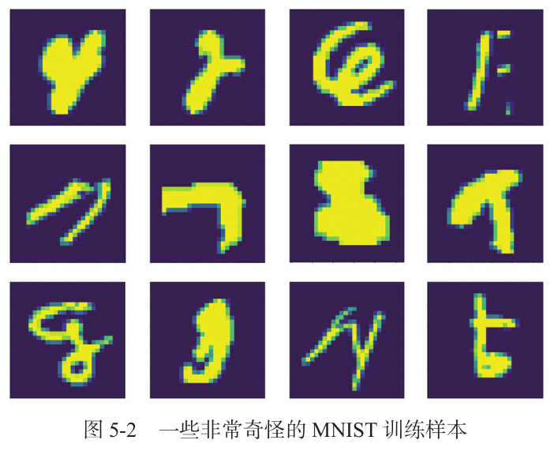

# 前言

FYT视觉组培训，针对RoboMaster的深度学习速成课。

预备知识：

- 学习完前面的C++培训知识，有基本的编程能力。
- 掌握Python的基本语法。

参考书籍：

- Deep Learning with Python Second Edition (主要讲tensorflow)
- DIVE INTO DEEP LEARNING (主要讲pytorch)
- 了解CV与RoboMaster视觉组 (视觉组圣经)

往年的深度学习文档：https://github.com/CSU-FYT-Vision/Vision-Tutorial

讲解人

> 计科2205 蔡明辰

---

# 1. 初识深度学习

## 1.1 什么是深度学习

深度学习（Deep Learning）是**机器学习**的一种方法，它利用多层**神经网络**对数据进行学习，并通过**反向传播**算法进行**梯度下降**，从而使得神经网络能够自动学习到数据的特征，并对未知数据进行**预测**。

## 1.2 RoboMaster与深度学习

在RoboMaster中，有许多需要使用到深度学习的地方，如图像识别、目标检测等。

- 装甲板检测：可以使用实时目标检测装甲板的位置，准确有效击打装甲板。
- 装甲数字识别：使用一个简单的图像分类网络，识别数字。
- 雷达：目标检测赛场上的各种敌我车辆，显示小地图，发动易伤buff。

所以RMer视觉也要掌握深度学习的基本知识。

## 1.3 机器学习与深度学习

### 1.3.1 机器学习

机器学习的主要任务是从数据中学习，并利用这些知识对未知数据进行预测或决策。机器学习的算法有**监督学习**、**无监督学习**、**半监督学习**、**强化学习**等。

- 输入数据。机器学习的输入数据可以是图像、文本、声音、视频等。
- 预期输出示例。机器学习的预期输出可以是分类、回归、聚类、排序等。
- 衡量算法效果的方法。衡量结果是一种反馈信号，用于调整算法。这个调整的步骤就是我们说的**学习**。
  


机器学习和深度学习的核心问题在于有意义地变换数据。换句话说，在于学习输入数据的有用表示——这种表示可以让数据更接近预期输出。

了解了**学习**的概念后，看看深度学习的特别之处。

### 1.3.2 深度学习之“深度”

深度学习是机器学习的一个分支，它利用多层神经网络对数据进行学习。


可以将深度神经网络看做一个多级的**信息蒸馏**：信息穿过多层过滤器，其纯度越来越高。

## 1.4 机器学习算法

> 本小节了解即可。

### 1.4.1 监督学习   

**监督学习**擅长在“给定输入特征”的情况下预测标签。

监督学习的学习过程一般可以分为三大步骤：

1. 从已知大量数据样本中随机选取一个子集，为每个样本获取真实标签。有时，这些样本已有标签（例如，患者是否在下一年内康复？）；有时，这些样本可能需要被人工标记（例如，图像分类）。这些输入和相应的标签一起构成了训练数据集；
   
2. 选择有监督的学习算法，它将训练数据集作为输入，并输出一个“已完成学习的模型”；
   
3. 将之前没有见过的样本特征放到这个“已完成学习的模型”中（测试集），使用模型的输出作为相应标签的预测。


- **回归**问题：输出是数值类型
  
   举例：通过各种影响因素预测房价、预测用户对一部电影的评分可以被归类为一个回归问题

- **分类**问题：输出是类别的分类问题的常见损失函数被称为 **交叉熵** （cross-entropy）
  
   举例：从手写数据集中区分0~9（类别问题）、以下图片是否是毒蘑菇（二分类问题）


模型通常给出的是一个概率：比如输入以上蘑菇，分类器可能输出0.8
可以这样理解：分类器90%确定图像描绘的是一只猫

### 1.4.2 无监督学习

监督学习要向模型提供巨大数据集：每个样本包含特征和相应标签值。

相反，如果工作没有十分具体的目标，就需要“自发”地去学习了。 比如，老板可能会给我们一大堆数据，然后要求用它做一些数据科学研究，却没有对结果有要求。 这类数据中不含有“目标”的机器学习问题通常被为 **无监督学习**（unsupervised learning）

- 聚类 （clustering）问题：没有标签的情况下，我们是否能给数据分类呢？比如，给定一组照片，我们能把它们分成风景照片、狗、婴儿、猫和山峰的照片吗？同样，给定一组用户的网页浏览记录，我们能否将具有相似行为的用户聚类呢？
  
- 主成分分析 （principal component analysis）问题：我们能否找到少量的参数来准确地捕捉数据的线性相关属性？比如，一个球的运动轨迹可以用球的速度、直径和质量来描述。再比如，裁缝们已经开发出了一小部分参数，这些参数相当准确地描述了人体的形状，以适应衣服的需要。另一个例子：在欧几里得空间中是否存在一种（任意结构的）对象的表示，使其符号属性能够很好地匹配?这可以用来描述实体及其关系，例如“罗马” − “意大利” + “法国” = “巴黎”。
  
- 因果关系 （causality）和 概率图模型 （probabilistic graphical models）问题：我们能否描述观察到的许多数据的根本原因？例如，如果我们有关于房价、污染、犯罪、地理位置、教育和工资的人口统计数据，我们能否简单地根据经验数据发现它们之间的关系？

- 生成对抗性网络 （generative adversarial networks）：为我们提供一种合成数据的方法，甚至像图像和音频这样复杂的非结构化数据。潜在的统计机制是检查真实和虚假数据是否相同的测试，它是无监督学习的另一个重要而令人兴奋的领域。

### 1.4.3 半监督学习

半监督学习（Semi-Supervised Learning, SSL）是一种介于监督学习和无监督学习之间的机器学习方法。它利用少量标注数据和大量未标注数据共同训练模型，目标是提高模型的性能，同时减少对标注数据的依赖。半监督学习方法在标注数据获取成本较高或数据标注较困难的场景中非常有用，例如医学影像分析、自然语言处理和计算机视觉等领域。

- 标记样本少的类别：可以用聚类算法来标记样本少的类别。
- 标记样本多的类别：可以用生成模型来标记样本多的类别。

### 1.4.4 强化学习

强化学习（Reinforcement Learning）是机器学习的一种方法，它通过与环境的互动来学习。

强化学习的目标是产生一个好的 **策略** （policy）。

模型根据对环境的观察产生一定的动作，将这个动作应用到环境当中，模型从环境中获得 **奖励**

举例：AlphaGo

[本科毕设 非嵌入式离线强化学习制作皇室战争AI与8000分人机的获胜对局](https://www.bilibili.com/video/BV1xn4y1R7GQ/?share_source=copy_web&vd_source=e4838a460d5e965db0426ab9bd050b56)

## 1.4 用三张图理解深度学习的工作原理


## 1.5 深度学习的硬件

CPU、GPU、TPU(张量处理器)

[【硬核科普】从零开始认识显卡](https://www.bilibili.com/video/BV1xE421j7Uv/?share_source=copy_web&vd_source=e4838a460d5e965db0426ab9bd050b56)

2007年，NVIDIA推出了CUDA，它是一种基于GPU的并行编程模型，可以让程序员编写并行代码，并在GPU上运行。

## 1.6 深度学习的历史与发展

### 1.6.1 神经网络的核心关键原则：
1. **线性和非线性处理单元的交替**  
   通常称为层（layers）。
2. **使用链式规则（也称为反向传播 Backpropagation）**  
   一次性调整网络中的全部参数。

### 1.6.2深度学习的提出历史：
- 一些中流砥柱的模型：
  - 多层感知机（McCulloch and Pitts, 1943）
  - 卷积神经网络（LeCun et al., 1998）
  - 长短期记忆网络（Graves and Schmidhuber, 2005）
  - Q学习（Watkins and Dayan, 1992）
- 曾因对休眠期和当时技术限制被搁置一段时间后，过去十年被重新发现。

### 1.6.3 为什么最近十几年深度学习才重新“热门”？
1. **网络和图像传感器的发展使得数据的获取变得廉价**  
   - 大量图片、视频和用户数据信息使得大规模数据集变得触手可及。
2. **运算设备的算力发展**  
   - GPU的普及，使大规模算力唾手可得。
3. **深度学习框架在传播想法方面发挥了至关重要的作用**  
   - 例如，PyTorch 和 TensorFlow。
   - 在2014年之前，对卡内基梅隆大学机器学习博士生来说，训练全性能回归模型曾是一个复杂的作业问题。而现在，这项任务只需不到10行代码即可完成。

# 2. 神经网络的基本数学概念

## 2.1 张量 (Tensor) 介绍

张量是多维数组的泛化，用于表示标量、向量、矩阵及更高维数据。

1. **标量 (Scalar)**  
   标量是零维张量，仅表示一个数值，例如：  
   ```python
   x = np.array(5)  # 标量
   ```

2. **向量 (Vector)**  
   向量是一维张量，例如：  
   ```python
   x = np.array([1, 2, 3])  # 向量
   ```

3. **矩阵 (Matrix)**  
   矩阵是二维张量，例如：  
   ```python
   x = np.array([[1, 2], [3, 4]])  # 矩阵
   ```

4. **张量 (Tensor)**  
   张量是更高维度的数组

## 2.2 张量运算的导数——梯度 (Gradient)

导数这一概念可以应用于任意函数，只要函数所对应的表面是连续且光滑的。张量运算（或张量函数）的导数叫作梯度（gradient）。梯度就是将导数这一概念推广到以张量为输入的函数，张量函数的梯度表示该函数所对应多维表面的曲率（curvature）。


## 2.3 链式求导（Chain Rule）

链式求导是神经网络梯度计算的核心工具，用于计算复合函数的导数。  

如果函数 $z = f(g(x))$，则导数计算为： 

$$
\frac{\partial z}{\partial x} = \frac{\partial z}{\partial g} \cdot \frac{\partial g}{\partial x}
$$

在神经网络中，每一层的输出是上一层的输入，链式求导用于将输出误差逐层反传以更新权重。
   
## 2.4 随机梯度下降 (Stochastic Gradient Descent)

给定一个可微函数，理论上可以用解析法找到它的最小值，找到所有导数为0的点，然后比较函数在其中哪个点的取值最小。将这一方法应用于神经网络，就是用解析法求出**损失函数**最小值对应的所有权重值。但在实际中，求解析解往往是不可行的。

> 一个两个参数求解析解还好说，但是神经网络的参数不会少于几千个，而且经常有上千万个。

SGD的步骤：

1. 抽取训练样本 x 和对应目标 y_true 组成的一个数据批量。
2. 在 x 上运行模型，得到预测值 y_pred。这一步叫作**前向传播**。
3. 计算模型在这批数据上的损失值，用于衡量 y_pred 和 y_true 之间的差距。
4. 计算损失相对于模型参数的梯度。这一步叫作**反向传播**（backward pass）。
5. 将参数沿着梯度的反方向移动一小步，比如 W -= learning_rate* gradient，从而使这批数据上的损失值减小一些。**学习率**（learning_rate）是一个调节梯度下降“速度”的标量因子。
   
|⼀维损失函数曲线的随机梯度下降|⼆维损失表⾯的梯度下降|
|---|---|
|||

如你所见，直观上来看，`learning_rate` 因子的取值很重要。如果取值太小，那么沿着曲线下降需要很多次迭代，而且可能会陷入局部极小点（鞍点）。如果取值过大，那么更新权重值之后可能会出现在曲线上完全随机的位置。


> 局部最⼩点的解决办法：动量。
> 
> 更新参数 w 不仅要考虑当前梯度值，还要考虑上⼀次参数更新。
> 
> w(新) = w(旧) + momentum(动量因⼦) * velocity - learning_rate * gradient

## 2.5 反向传播 (Backpropagation)

反向传播是通过**链式法则**计算神经⽹络梯度的算法。

反向传播的⼯作流程：
1. 前向传播：从输⼊层到输出层计算⽹络的预测值。
2. 损失计算：通过损失函数衡量预测值与真实值的误差。
3. 反向传播：利⽤链式求导从输出层逐层计算梯度。
4. 参数更新：使⽤优化器更新权重和偏置。

## 2.6 优化器 (Optimizer)

优化器是用于最小化损失函数的算法，通过梯度更新神经网络的参数。

### 常见优化器

1. **随机梯度下降 (SGD)**  

- 批量随机梯度下降，随机梯度下降，小批量随机梯度下降

2. **AdaGrad**  

- 适合处理稀疏数据，但学习率可能逐渐变小。

3. **RMSProp**  

- 通过均方根调整学习率，适合非平稳目标。

4. **Adam**  
综合了动量法和 RMSProp：  

## 2.7 用计算图看正向传播和反向传播


前向传播的过程比较简单，从输入层开始，逐层计算每一层的输出，直到得到最终的预测值。

“如果反过来看？”

|||
|---|---|
|||

对该图应用**链式法则**，可以计算出我们想要的梯度（损失函数相对于参数的梯度偏导）：

- grad(loss_val,w) = 1 x 1 x 2 = 2
- grad(loss_val,b) = 1 x 1 = 1

然后，我们就可以用这些梯度来更新参数w和b了。

# 3. 从线性回归到神经网络

## 3.1 主要目的

学习如何⽤PyTorch编程。

## 3.2 任务目标

线性回归的式⼦满⾜：y = w*x + b，其中w和b均为参数，x，y可以理解成特征值和⽬标值，在程序中我们指定x，w，b，⽬标值y也随之确定了下来。然后将x通过神经⽹络进⾏训练，我们希望通过训练，使得随机初始化的参数w和b能够逼近⼀开始我们指定的w，b，使得预测值pred和实际的⽬标值y能够⽆限接近。


## 3.3 损失函数 (Loss Function)

损失函数⽤于衡量模型预测值与真实值的差距。通常我们会选择⾮负数作为损失，且数值越⼩表⽰损失越⼩，完美预测时的损失为0。回归问题中最常⽤的损失函数是平⽅误差函数。

$$ 
l^{(i)}(\mathbf{w}, b) = \frac{1}{2} \left( \hat{y}^{(i)} - y^{(i)} \right)^2
$$

> $\frac{1}{2}$并不会带来本质上的区别，只是为了求导简单


我们需要计算在训练集n个样本上的损失均值：

$$ 
L(\mathbf{w}, b) = \frac{1}{n} \sum_{i=1}^{n} l^{(i)}(\mathbf{w}, b) = \frac{1}{n} \sum_{i=1}^{n} \frac{1}{2}
\left( \mathbf{w}^\top \mathbf{x}^{(i)} + b - y^{(i)} \right)^2. 
$$

## 3.4 代码实现

```python
import torch
import torch.nn as nn
import torch.optim as optim
import matplotlib.pyplot as plt

# 1. 生成数据
# 创建一些模拟数据，假设 y = 3x + 2 + 噪声
torch.manual_seed(42)  # 设置随机种子
x = torch.linspace(0, 10, 100).unsqueeze(1)  # 输入数据 (100, 1)
y = 3 * x + 2 + torch.randn(100, 1) * 2  # 输出数据带噪声 (100, 1)

# 2. 定义一个简单的线性回归模型
class LinearRegressionModel(nn.Module):
    def __init__(self):
        super(LinearRegressionModel, self).__init__()
        self.linear = nn.Linear(1, 1)  # 输入特征维度1，输出特征维度1

    def forward(self, x):
        return self.linear(x)

model = LinearRegressionModel()

# 3. 定义损失函数和优化器
criterion = nn.MSELoss()  # 均方误差损失
optimizer = optim.SGD(model.parameters(), lr=0.01)  # 随机梯度下降优化器

# 4. 训练模型
epochs = 100  # 迭代次数
losses = []  # 记录损失

for epoch in range(epochs):
    model.train()  # 设置为训练模式
    optimizer.zero_grad()  # 清空梯度

    predictions = model(x)  # 模型预测
    loss = criterion(predictions, y)  # 计算损失
    loss.backward()  # 反向传播计算梯度
    optimizer.step()  # 更新模型参数

    losses.append(loss.item())  # 记录损失

    # 每100次输出一次训练信息
    if (epoch + 1) % 10 == 0:
        print(f"Epoch {epoch+1}/{epochs}, Loss: {loss.item():.4f}")

# 5. 可视化训练结果
# 绘制损失曲线
plt.figure(figsize=(10, 5))
plt.plot(range(epochs), losses)
plt.title("Loss Curve")
plt.xlabel("Epochs")
plt.ylabel("MSE Loss")
plt.show()

# 绘制预测结果
model.eval()  # 设置为评估模式
with torch.no_grad():
    predicted = model(x)  # 模型预测

plt.figure(figsize=(10, 5))
plt.scatter(x.numpy(), y.numpy(), label="Ground Truth")  # 原始数据
plt.plot(x.numpy(), predicted.numpy(), color="red", label="Predicted")  # 预测结果
plt.legend()
plt.title("Linear Regression Result")
plt.show()
```

|||
|---|---|
|损失曲线|预测结果|

学习链接：[详解使⽤pytorch实现线性回归](https://blog.csdn.net/Delusional/article/details/113097030?fromshare=blogdetail&sharetype=blogdetail&sharerId=113097030&sharerefer=PC&sharesource=m0_72845244&sharefrom=from_link)


# 4. 机器学习基础知识

## 4.1 机器学习的目标

泛化：模型在未见过的数据上的表现。

### 4.1.1 ⽋拟合和过拟合

> 根据泛化的定义，我们希望模型在我们没有训练过的数据上也取得很好的效果，⽽不是只在训练集上有很好的效果。

- 欠拟合：模型在训练集和测试集上表现都很差。

- 过拟合：模型在训练集上表现很好，但在测试集上表现很差。

其实很好理解，训练开始时，模型还没有对训练数据中的所有相关模式建模。因此，模型在训练集和测试集上的表现都很差，这就是欠拟合。

训练到一定程度后，模型开始仅学习和训练数据有关的模式，并且开始学习训练数据中的噪声和细节，但对新数据而言，这些噪声和细节是不相关的。这就是过拟合。


### 4.1.2 嘈杂的训练数据

MNIST数据集中就有很多异常值。

|||
|----|----|
||

如果模型将这些异常值(噪声)全部考虑进去，那么它的泛化性能将会下降


左边是稳健拟合，右边是过拟合

## 4.2 评估机器学习的性能

> 优化和泛化之间的矛盾，欠拟合和过拟合之间的矛盾

### 4.2.1 训练集、验证集和测试集

1. 简单的留出验证
   - 一般验证集占数据集的20%
2. K折交叉验证
   - 有时候验证集很少，无法在统计学上代表数据
   

### 4.2.2 评估模型的注意事项

- 数据的代表性
- 数据冗余

## 4.3 改进模型拟合

1. 调节关键梯度下降参数

   - 学习率
   - 批量大小
  
2. 利用更好的模型架构

3. 提高模型的容量(大小)

## 4.4 提高模型的泛化能力

1. 数据集管理
2. 提前终止，防止过拟合
3. 模型正则化
   - 缩减模型容量
   - 权重正则化
   - Dropout
      

# 5. 多层感知机（MLP）从入门到实践

在上⾯的线性神经⽹络中我们了解很多深度学习的概念，那现在我们要深⼊对于深度神经⽹络的探索。

## 5.1 隐藏层 (Hidden Layer)

> 隐藏层是神经⽹络的核⼼，它可以帮助我们学习⾮线性关系。

在线性⽹络中我们描述了仿射变换，这在深度学习种是⼀种线性变换，如果我们的输⼊输出满⾜线性关系，那么这样就⾜够了，但是线性是⼀个很强的假设；线性模型是很容易出错的，因为我们⽆法保证线性相关的关系。

举例：

1. 我们尝试预测⼀个⼈是否会还贷，我们可以认为，在其他条件不变的情况下，收⼊较⾼的申请⼈⽐收⼊较低的申请⼈更有可能偿还贷款。但是，虽然收⼊与还款概率存在单调性，但它们不是线性相关的。收⼊从0增加到5万，可能⽐从100万增加到105万带来更⼤的还款可能性。
   
2. 我们想要根据体温预测死亡率。 对体温⾼于37摄⽒度的⼈来说，温度越⾼⻛险越⼤。然⽽，对体温低于37摄⽒度的⼈来说，温度越⾼⻛险就越低。

我们可以通过在⽹络中加⼊⼀个或多个隐藏层来克服线性模型的限制，使其能处理更普遍的函数关系类型。最简单的⽅法就是将多个全连接层连接到⼀起，这种架构通常称为多层感知机（multilayer perceptron），通常缩写为 **MLP**。


- 这是⼀个两层的⽹络
- 对于这种输入和输出的每个节点都相连的层，我们一般称为**全连接层**或**稠密层**
- 全连接层的开销⾮常⼤，需要权衡性能和参数规模

仿射变换=权重*参数+偏置

> 仿射变换的组合还是仿射变换

那么这个模型还是线性的，依然没有解决上述线性模型表达能⼒弱的问题，我们需要有⼀个函数使他变成⾮线性的：**激活函数**

如果没有激活函数，那么每个隐藏层仅仅只是⼀个仿射函数，与线性模型并⽆区别，为了避免多层感知机模型退化成线性模型，我们需要引⼊激活函数。

## 5.2 激活函数 (Activation Function)

激活函数引⼊⾮线性特性，使神经⽹络能够拟合复杂的函数。

### 常见激活函数

1. Sigmoid

$$ 
\sigma(x) = \frac{1}{1 + e^{-x}} 
$$

- 将输出映射到 (0, 1)，适⽤于概率预测。
- 容易引发梯度消失问题。


1. Tanh
$$ 
\tanh(x) = \frac{e^x - e^{-x}}{e^x + e^{-x}} 
$$

1. ReLU (Rectified Linear Unit)
   
$$ 
\text{ReLU}(x) = \max(0, x) 
$$

- 当输⼊为负时，ReLU函数的导数为0，⽽当输⼊为正时，ReLU函数的导数为1。
- 注意，当输⼊值精确等于0时，ReLU函数不可导。在此时，我们默认使⽤左侧的导数，即当输⼊为0时,导数为0。但我们可以忽略这个问题，在⼯程实际中，⼏乎是永远不可能为0的。


1. Softmax

$$ 
\text{Softmax}(x_i) = \frac{e^{x_i}}{\sum_{j=1}^n e^{x_j}} 
$$

- ⽤于多分类任务，将输出转化为概率分布。

## 5.3 softmax分类

softmax分类器是多分类问题中常用的分类器，它将输入的特征映射到一个概率分布，使得每个类别的概率之和为1。


现在经过上面三个公式（等于是三个单独的线性回归）的计算，我们已经得到了三个数；为了得到最后预测结果是啥，我们选择最大概率的标签为预测结果。

假设输出为0.1，0.8，0.1，那么我们预测的类别就是2

## 5.4 MLP实战——MNIST⼿写数字识别

MNIST数据集包含60,000个训练样本和10,000个测试样本，每个样本是一个28x28像素的灰度图像，表示一个手写数字（0-9）。目标是训练一个模型，能够准确地识别这些手写数字。

CSDN博客：[keras⼊⻔实例(MNIST数字分类)](https://blog.csdn.net/m0_72845244/article/details/131730803?fromshare=blogdetail&sharetype=blogdetail&sharerId=131730803&sharerefer=PC&sharesource=m0_72845244&sharefrom=from_link)

### Pytorch加载数据集

```python
import torch
from torchvision import datasets, transforms

# 数据预处理
transform = transforms.Compose([
    transforms.ToTensor(),  # 转为 PyTorch 的 Tensor 格式
    transforms.Normalize((0.5,), (0.5,))  # 对数据进行归一化，均值和标准差为 0.5
])

# 加载训练集和测试集
train_dataset = datasets.MNIST(root='./data', train=True, transform=transform, download=True)
test_dataset = datasets.MNIST(root='./data', train=False, transform=transform, download=True)

# 数据加载器
train_loader = torch.utils.data.DataLoader(dataset=train_dataset, batch_size=64, shuffle=True)
test_loader = torch.utils.data.DataLoader(dataset=test_dataset, batch_size=64, shuffle=False)

print(f"训练集样本数: {len(train_dataset)}")
print(f"测试集样本数: {len(test_dataset)}")
```

[神经网络可视化](https://www.bilibili.com/video/BV1Rz4y1h7nN/?share_source=copy_web&vd_source=e4838a460d5e965db0426ab9bd050b56)

# 5. Linux下配置深度学习环境

## 5.1 安装显卡驱动

强烈建议通过ubuntu22.04的官⽅GUI软件 **软件和更新** 安装显卡驱动。(Linux官⽅把nvidia驱动已经做的相当好了，安装起来也很⽅便。但是NVIDIA驱动其实还会有各式各样的BUG，包括Linux之⽗Linus Torvalds曾经说过的那样：“NVIDIA是最难伺候的硬件制造商，也是我们接触过最糟糕的公司，没有之⼀，~~SO NVIDIA FUCKNVIDIA YOU~~”.)

图标⻓这样(有时候它是灰⾊的), 

安装成功后在终端使⽤`nvidia-smi`可以看到GPU信息，看到就算安装成功

```bash
nvidia-smi
```


这⾥显⽰的CUDA版本是最⾼⽀持版本，安装个⽐这低的就⾏(但是也不能太低，下⾯会讲)。


如果想要更改显卡驱动，也可以在这⾥改。

> 显卡驱动安装需要谨慎对待，尽量安装recommend版本，否则可能会导致ubuntu桌⾯不显⽰、开机不了、电脑副屏幕不显⽰等问题。

> 装错显卡驱动时，不到万不得已，不要使⽤`sudo apt autoremove`，这是下下策。

## 5.2 安装CUDA

显卡驱动版本和CUDA版本有⼀定的对应关系。

CUDA版本：[CUDA Toolkit Archive](https://developer.nvidia.com/cuda-toolkit-archive)

CUDA版本和驱动版本的对应关系可以看: [不同版本cuda对应的NVIDIA驱动版本](https://sundaygeek.blog.csdn.net/article/details/86695400?fromshare=blogdetail&sharetype=blogdetail&sharerId=86695400&sharerefer=PC&sharesource=m0_72845244&sharefrom=from_link)

> 但是CUDA版本也不⼀定是越新越好，某些较新的CUDA版本可能没有pytorch的适配版本，所以安装时要注意。(这其实是配环境很常⻅的事情，不同软件由不同公司⼚家开发，进度各有快慢，版本兼容性也不⼀样，所以需要注意。)

**不要下载deb格式的，下载runfile！！！！**

Cuda的⼀个安装教程： https://yinguobing.com/install-cuda11-with-runfile/

```bash
nvcc -V
```


如果显⽰了这个代表安装成功。这⾥显⽰的CUDA版本是11.5，同学们也可以下载这个版本的CUDA。

## 5.3 安装Python环境

我们要使⽤pip⼯具安装深度学习的⼀些包，有numpy、tensorflow、keras、pytorch等

```bash
pip install numpy tensorflow keras torch torchvision -i https://pypi.tuna.tsinghua.edu.cn/simple
```

后⾯的 https://pypi.tuna.tsinghua.edu.cn/simple 是清华⼤学的镜像源地址，下载速度⽐较快。

如果不想安装tensorflow，可以只安装pytorch。把 tensorflow keras 去掉。

> 这⾥的安装命令是安装最新版本适配你电脑python环境的包，如果想安装特定版本的包，可以加上版本号。

> 如果发现还是下载不了，也可以在官⽹上找到你想要torch和torchvision的版本，然后⼿动下载安装。

官⽹下载：[torch版本⼤全](https://download.pytorch.org/whl/torch_stable.html)

然后使⽤pip安装。

```bash
pip install *.whl
```

最后，检查⼀下pytorch是否安装成功。是否能使⽤cuda。
```bash
python
import torch
torch.cuda.is_available()
```
如果能输出True，那么恭喜你安装成功。

## 5.4 安装Anaconda

Anaconda是⼀个python包管理虚拟环境（可装可不装，不过还是建议装上）

官⽹： https://zhuanlan.zhihu.com/p/459607806

可以参考的国内教程： https://zhuanlan.zhihu.com/p/459607806

官⽹安装教程： https://docs.anaconda.com/free/anaconda/install/linux/

因为ubuntu22.04默认安装了python3.10.7，正常就是ROS2 Humble需要的python版本，所以可以直接使⽤本机的python版本。

> 如果有需要使⽤某些Qt程序，⽐如PyQt5，可能需要利⽤Anacoda安装python的3.9版本才能使⽤Qt。正常使⽤时来回切换python版本即可。

```bash
conda create -n XXX python=3.9
conda activate XXX # 进入虚拟环境
```

```bash
conda deactivate # 退出虚拟环境
```

> 如果配置有困难的同学可以先使⽤`Google Colab`进⾏深度学习实验。但是配环境是每⼀个RoboMaster
视觉组新⼿⼩⽩都需要的基本能⼒，建议⼤家都掌握。

---

# 作业

重新实现课上的MNIST⼿写数字识别分类的例子。

要求：
1. 使用PyTorch实现。
2. 要求使用**多层感知机（MLP）**模型。
3. 在Gitee中提交python代码或或ipynb文件和训练结果(曲线图)。

截止日期：看群通知。