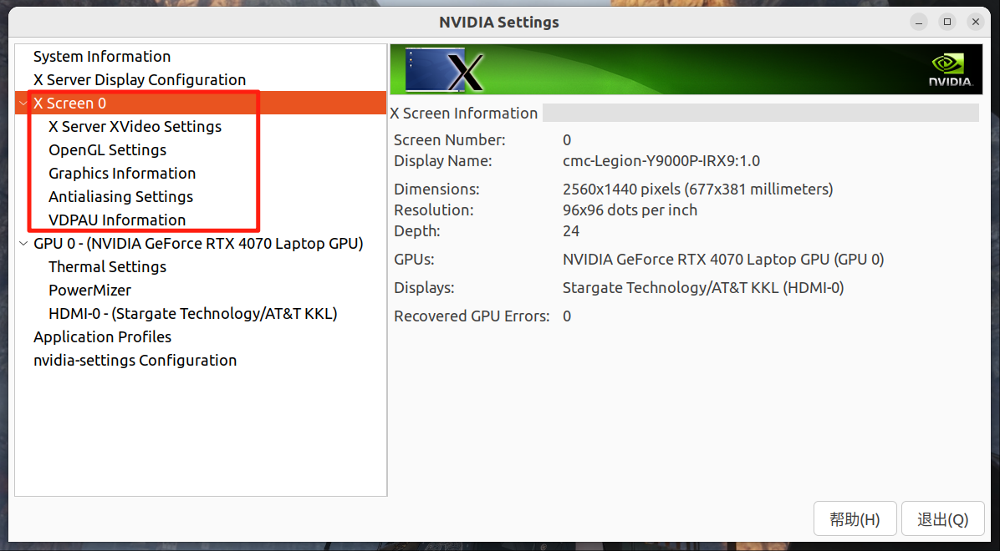
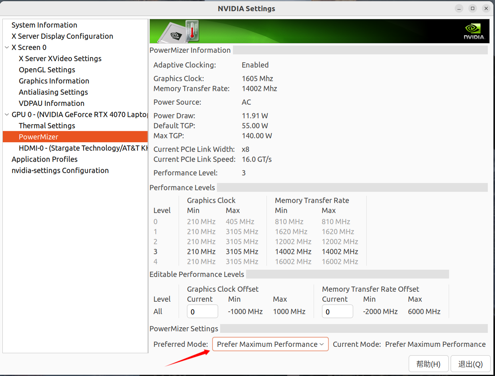

最近重装笔记本的ubuntu显卡驱动后，突然发现本来好好的外接显示器变得卡顿掉帧率了，尤其是使用浏览器看视频的时候，画面、鼠标移动非常卡顿，但是声音播放没什么问题。

经过一番排查，发现是因为外接显示器没有正确使用独立显卡导致的。终端输入一下指令：

```bash
glxinfo | grep "OpenGL renderer"
```

如果看到

```
Mesa Intel Graphics
```

那说明 **整个桌面和浏览器都在用核显**。

核心做法

```
sudo prime-select nvidia
sudo reboot
```

重启后再次输入

```bash
glxinfo | grep "OpenGL renderer"
```
就能看到

```
OpenGL renderer string: NVIDIA GeForce RTX 4070 Laptop GPU/PCIe/SSE2
```

另外，打开显卡设置界面就可以看到显卡已经接上外界显示器了，

```
sudo apt install nvidia-settings
nvidia-settings
```



同时还可以在显卡设置这里修改显卡功率一达到更好的性能表现。

