# 前言

FYT视觉组培训，针对RoboMaster的深度学习速成课。

预备知识：

- 学习完前面的C++培训知识，有基本的编程能力。
- 掌握Python的基本语法。

参考书籍：

- Deep Learning with Python Second Edition (主要讲tensorflow)
- DIVE INTO DEEP LEARNING (主要讲pytorch)
- 了解CV与RoboMaster视觉组 (视觉组圣经)

讲解人

> 计科2205 蔡明辰

---

# 1. 计算机视觉深度学习入门

计算机视觉是深度学习最早也是最重要的成功案例。当时一类叫做**卷积神经网络**(Convolutional Neural Network, CNN)的神经网络模型在图像分类任务上取得了非常优秀的性能，从此计算机视觉领域进入了深度学习时代。**卷积神经网络**是计算机视觉领域最常用的深度学习模型，也是我们主要学习的内容。

## 1.1 从认识一个卷积神经网络(CNN)开始

我们先来看一个简单的卷积神经网络模型示例，用语对MNIST数据集进行分类。虽然在上一讲我们已经用密链接网络做过，当时的测试精度约为97%，但现在我们用卷积神经网络来做，效果会更好。

```python
import torch
import torch.nn as nn

class LeNet(nn.Module):
    def __init__(self, num_classes=10):
        super(LeNet, self).__init__()
        # 卷积层1
        self.conv1 = nn.Conv2d(in_channels=1, out_channels=6, kernel_size=5, stride=1, padding=2)
        # 池化(汇聚)层1
        self.pool1 = nn.MaxPool2d(kernel_size=2)
        # 卷积层2
        self.conv2 = nn.Conv2d(in_channels=6, out_channels=16, kernel_size=5, stride=1)
        # 池化(汇聚)层2
        self.pool2 = nn.MaxPool2d(kernel_size=2)
        # 展开
        self.flatten = nn.Flatten()
        # 三个全连接层
        self.fc1 = nn.Linear(in_features=16 * 5 * 5, out_features=120)
        self.fc2 = nn.Linear(in_features=120, out_features=84)
        self.fc3 = nn.Linear(in_features=84, out_features=num_classes)
        # 声明两个激活函数
        self.act = nn.ReLU(inplace=True)
        self.softmax = nn.Softmax(dim=1)

    def forward(self, x):
        y = self.act(self.conv1(x))
        y = self.pool1(y)
        y = self.act(self.conv2(y))
        y = self.pool2(y)
        y = self.flatten(y)
        y = self.act(self.fc1(y))
        y = self.act(self.fc2(y))
        y = self.fc3(y)
        y = self.softmax(y)
        return y
```

```python
from torchsummary import summary

# 创建模型实例
model = LeNet(num_classes=10)

# 将模型放到设备上 (CPU 或 GPU)
device = torch.device("cuda" if torch.cuda.is_available() else "cpu")
model.to(device)

# 使用 torchsummary 显示模型摘要
summary(model, input_size=(1, 28, 28))
```

```
----------------------------------------------------------------
        Layer (type)               Output Shape         Param #
================================================================
            Conv2d-1            [-1, 6, 28, 28]             156
              ReLU-2            [-1, 6, 28, 28]               0
         MaxPool2d-3            [-1, 6, 14, 14]               0
            Conv2d-4           [-1, 16, 10, 10]           2,416
              ReLU-5           [-1, 16, 10, 10]               0
         MaxPool2d-6             [-1, 16, 5, 5]               0
           Flatten-7                  [-1, 400]               0
            Linear-8                  [-1, 120]          48,120
              ReLU-9                  [-1, 120]               0
           Linear-10                   [-1, 84]          10,164
             ReLU-11                   [-1, 84]               0
           Linear-12                   [-1, 10]             850
          Softmax-13                   [-1, 10]               0
================================================================
Total params: 61,706
Trainable params: 61,706
Non-trainable params: 0
----------------------------------------------------------------
Input size (MB): 0.00
Forward/backward pass size (MB): 0.11
Params size (MB): 0.24
Estimated Total Size (MB): 0.35
----------------------------------------------------------------
```

### 1.1.1 卷积运算

在数学中，卷积的定义为：

$$
(f*g)(t) = \int_{-\infty}^{\infty} f(t-\tau)g(\tau)d\tau
$$

> 严格来说，卷积层是个错误的说法，因为它所表示的运算其实是**互相关运算**，而不是卷积运算。

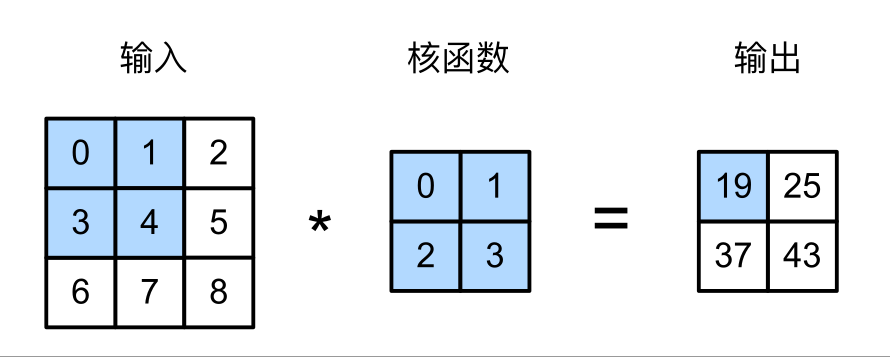

二维互相关运算：0 x 0 + 1 x 1 + 3 x 2 + 4 x 3 = 19

所以，输出大小等于输入大小 $n_h \times n_w$ 减去卷积核大小 $k_h \times k_w$（边界效应），即：

$$
(n_h - k_h + 1) \times (n_w - k_w + 1)
$$

**填充**：为了不让图像因为边缘效应经过深度网络层层越卷越小，通常会在图像边缘补零，即在图像边缘添加一些额外的像素，使得图像边缘的像素值与图像中心的像素值相等。

> 卷积层当中也有偏置项，偏置项和卷积核内的参数都是需要训练的(~~下面要考~~)。

### 1.1.2 图像卷积

Dense 层与卷积层的根本区别在于，Dense 层从输入特征空间中学到的是全局模式（比如对于 MNIST 数字，全局模式就是涉及所有像素的模式），而卷积层学到的是局部模式（对于图像来说，局部模式就是在输入图像的二维小窗口中发现的模式）。

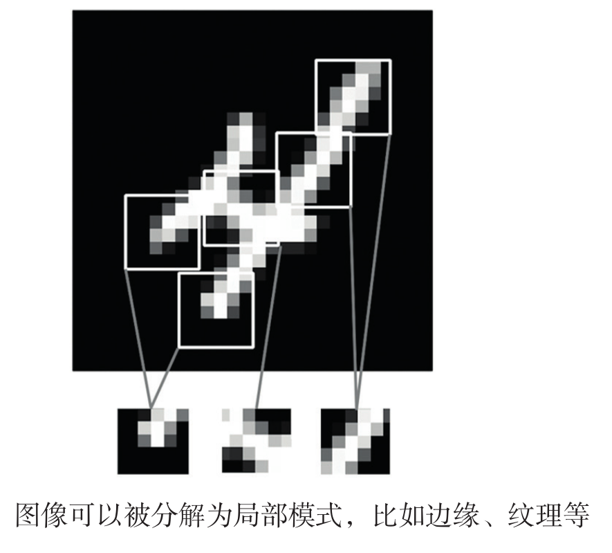

卷积网络的两个重要特性：

- 卷积神经网络学到的模式具有**平移不变性**。
- 卷积神经网络可以学到**模式的空间层次结构**(**局部性**)。

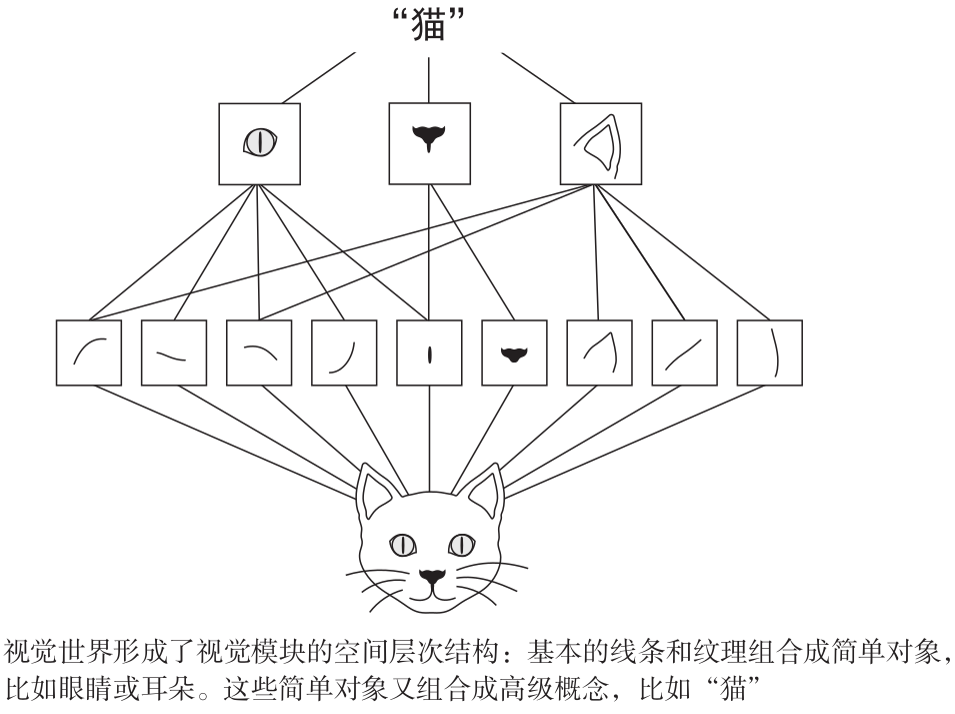

在MNIST的实例中，第一个卷积层接收的**特征图**是(1,28,28)，并输出尺寸为(6,28,28)的特征图。这是为什么呢？

```python
self.conv1 = nn.Conv2d(in_channels=1, out_channels=6, kernel_size=5, stride=1, padding=2)
```
先分析一下这段代码的含义：

- in_channels=1 表示输入图像的通道数为1
- out_channels=6 表示输出图像的通道数为6
- kernel_size=5 表示卷积核的大小为5x5
- stride=1 表示卷积步长为1
- padding=2 表示填充2个像素

一共有6个卷积核，每个卷积核都要分别对输入图像卷积运算一次，所以输出图像的通道数为6。

> 这就是**特征图**这一术语的含义：深度轴上每个维度都是一个特征(卷积核或叫滤波器filter)。

因为卷积核大小为5x5，由于**边界效应**，输出的特征图的边框会比输入图像小2个像素。但是因为又在周围填充了2个像素，所以输出的特征图的大小还是原来的大小。

所以输出尺寸为(6,28,28)。

理解了图像卷积的过程，我们现在还可以看看为什么第一层卷积的参数量是156。

- 卷积核数量为6，卷积核的尺寸为(1,5,5)，所以参数量为5x5x1x6=150。
- 还有**偏置项**，偏置项的数量为6，所以参数量为6。
- 所以一共为5x5x1x6+6=156。

### 1.1.3 一个特殊的卷积核 1x1卷积

1×1 卷积核丧失了影响高度和宽度的能力，但是它可以影响通道数。

我们可以将 1×1 卷积层看作在每个像素位置应用的全连接层，以 $c_i$ 个输入值转换为 $c_o$ 个输出值。因为这仍然是一个卷积层，所以跨像素的权重是一致的。

- 当以每像素为基础应用时，1×1 卷积层相当于全连接层。
- 1×1 卷积层通常用于调整网络层的通道数量和控制模型复杂性。

### 1.1.4 最大汇聚运算

在上面那个卷积神经网络的例子中，你可能注意到每经过一次MaxPool2d层，输出图像的尺寸就会缩小一半。

这就是汇聚层(有的地方也叫**池化层**)的作用：主动对特征图进行下采样。

但是为什么一定要下采样，直接用原图，保留较大特征图不好吗？

- 减少需要处理的特征图的元素个数，减少参数量，防止过拟合。
- 让连续卷积层的观察窗口越来越大，从而引起空间滤波器的层次结构。

```python
self.pool1 = nn.MaxPool2d(kernel_size=2)
```

一个池化窗口为2的池化层。

平均池化(Average Pooling)，最大池化(Max Pooling)都是池化层的一种。

但是往往最大池化(Max Pooling)的效果更好，因为它能够保留更多的特征，特征的最大值能够保留更多的信息。

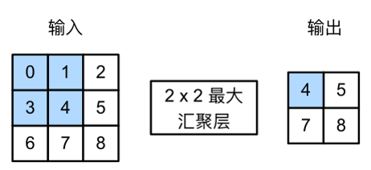

### 1.1.3 详解LeNet-5

看到这里，其实上面那个LeNet-5模型的结构已经很清晰了。

LeNet-5是深度学习之父，Yann LeCun于1998年提出的最早的卷积神经网络，当时是用来解决手写体数字识别问题，其网络结构图如下所示，从LeNet-5开始，CNN就形成了若干个（卷积、池化）层+（用于特定任务的全连接层）的范式

在经过层层卷积池化后，最后连接一个flatten层，将二维特征图拉平，形成一条直线，最后输入到特定的全连接神经网络中。

```python
self.flatten = nn.Flatten()
```

拉平后，先后输入120个神经元，84个神经元和10个神经元的密连接层中。

```python
self.fc1 = nn.Linear(in_features=16 * 5 * 5, out_features=120)
self.fc2 = nn.Linear(in_features=120, out_features=84)
self.fc3 = nn.Linear(in_features=84, out_features=num_classes)
```

最后用softmax函数，求出每个输出的权重。

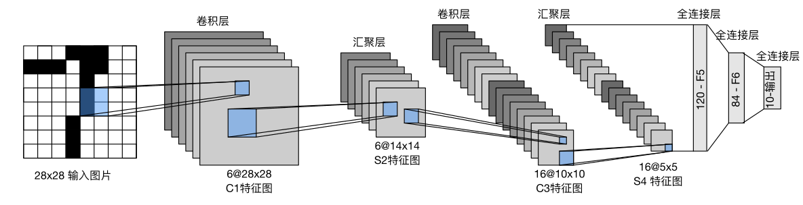

在RoboMaster中，FYT视觉组用的识别装甲板数字的模型就是基于LeNet5的。LeNet5模型结构简单，参数少，适合在嵌入式设备上运行。

[【Minecraft】红石卷积神经网络——原理](https://www.bilibili.com/video/BV1wF411F7PU/?share_source=copy_web&vd_source=e4838a460d5e965db0426ab9bd050b56)

## 1.2 AlexNet改变世界的神经网络

在LeNet-5的年代，深度学习并没有受到机器学习研究者的重视，理由是深度学习需要大量的计算量，参数多，需要大量的数据集供于训练。2012年，Alex Krizhevsky，Ilya Sutskever和Yoshua Bengio提出了AlexNet，并在同年的ImageNet图像分类竞赛上以压倒性的优势夺得了冠军。AlexNet获得成功的关键是

- ImageNet2012提供了大量的已标注数据集，使得大规模的网络有足够的数据进行学习
- 利用CUDA技术，Alex Krizhevsky和Ilya Sutskever实现了可以在GPU硬件上运行的深度卷积神经网络，而神经网络这种基于矩阵运算的模型能够在GPU上快速运算，突破了深度网络训练的瓶颈。

下图为LeNet-5（左）和AlexNet（右）的对比，AlexNet任然保留了N个卷积池化+全连接层的形式。

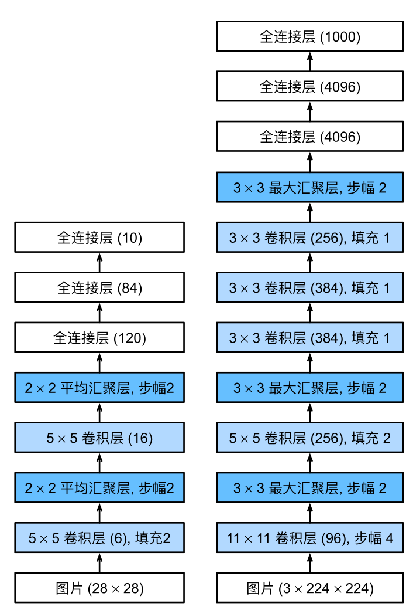

## 1.3 "猫狗大战"——VGG16

首先下载`Kaggle`数据集，[下载网址](https://www.kaggle.com/datasets/shaunthesheep/microsoft-catsvsdogs-dataset)，点击Download -> 点击Download as Zip。

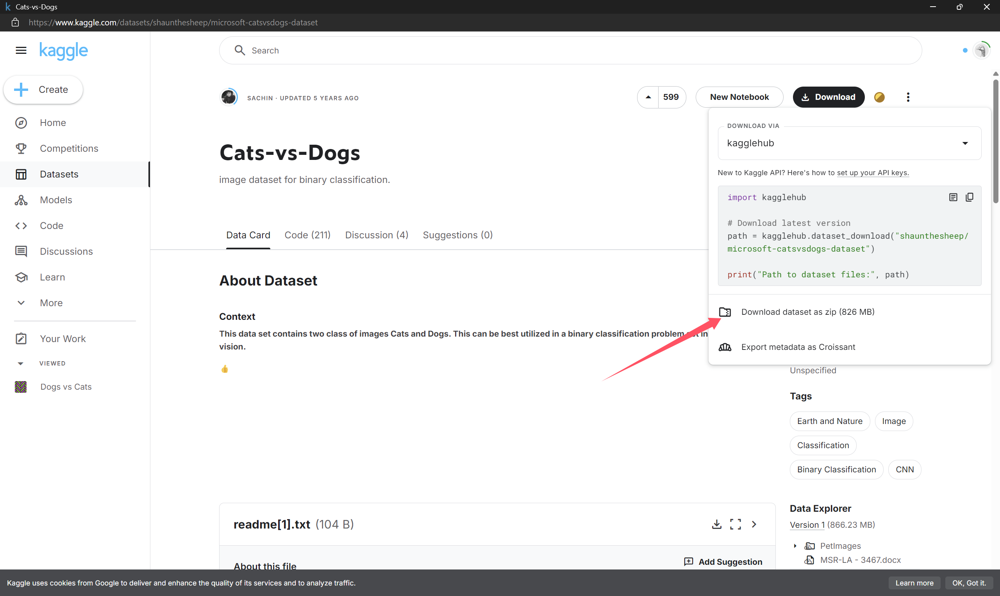

[博客链接](https://blog.csdn.net/m0_72845244/article/details/131965310?fromshare=blogdetail&sharetype=blogdetail&sharerId=131965310&sharerefer=PC&sharesource=m0_72845244&sharefrom=from_link)

VGG16是2014年ImageNet图像分类竞赛的冠军，其结构如下图所示：

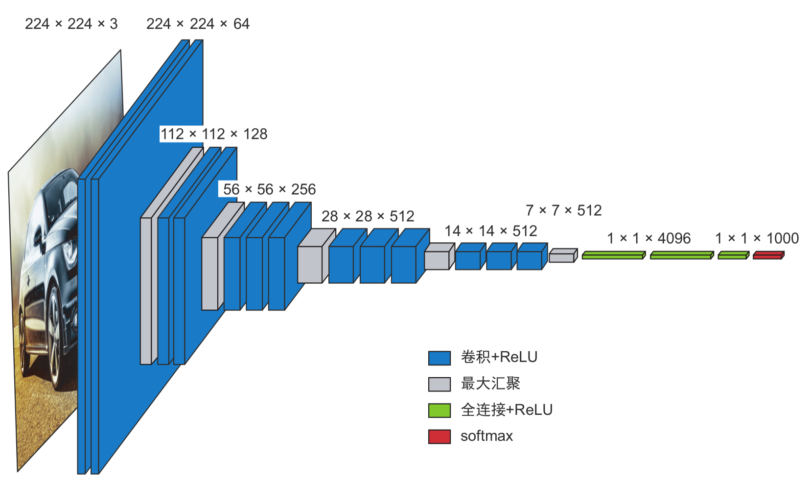

就如 LeNet 和 AlexNet，卷积神经网络可以简化为的形式：

$$
\text{神经网络} = N * (n * Conv + MaxPool) + DetectionHead\text{(检测头)}
$$

VGG 网络就是这样，他们将 $(n * Conv + MaxPool)$ 作为一个基本模块（VGG 块），通过不同模块的拼接，设计了 VGG-16、VGG-19 等不同的网络，都取得了不错的效果。

# 2. 计算机视觉深度学习进阶

## 2.1 三项基本的计算机视觉任务

### 2.1.1 图像分类

为图像指定一个或多个标签。它既可以是单标签分类（一张图像只能属于一个类别，不属于其他类别），也可以是多标签分类（找出一张图像所属的所有类别）

例如：识别一张图片是猫还是狗(二分类)、识别一张手写数字图片是数字几(多分类)、识别一张RM机器人车辆图片是什么兵种什么阵营(多分类多标签)。

### 2.1.2 图像分割

将图像“分割”或“划分”成不同的区域，每个区域通常对应一个类别

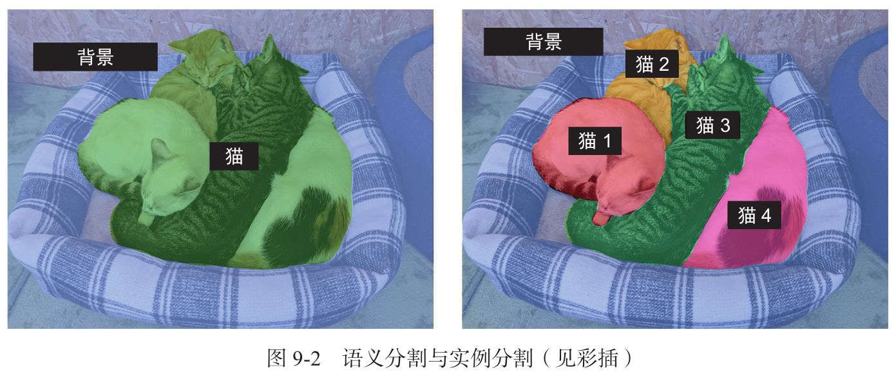

### 2.1.3 目标检测

在图像中感兴趣的目标(ROI)周围绘制矩形（称为边界框）并给出每个矩形对应的类别。

例如，检测相机采样的照片帧中，RM机器人车辆在二维图片中的位置和机器人的种类。如YOLO算法。

## 2.2 现代卷积神经网络的架构模式

### 2.2.1 模型架构

模型架构往往会决定成败。如果你选择了不合适的架构，那么模型可能会被次优指标拖累，再多的训练数据也无法改进它。相反，良好的模型架构可以加速学习过程，让模型可以有效利用训练数据，并降低对大型数据集的需求。一个良好的模型架构可以**减小搜索空间**，或者**更容易收敛到搜索空间的良好位置**。就像特征工程和数据收集一样，模型架构就是为了能够利用梯度下降**更轻松地解决问题**。

模型架构更像是一门艺术，而不是一门科学。经验丰富的机器学习工程师能够在第一次尝试时就凭直觉拼凑出高性能的模型，而初学者往往很难构建出一个可用于训练的模型。这里的关键词是**直觉**：没人可以向你清楚地解释什么有效、什么无效。

> 可解释性差，黑盒

### 2.2.2 残差连接

> 传话游戏：y = f4(f3(f2(f1(x))))

如果函数链太长，那么这些噪声会盖过梯度信息，反向传播就会停止工作，模型也就根本无法训练。这就是**梯度消失（vanishing gradient）**问题。

当人们发现深度卷积网络能有效从图片中提取特征时，人们就致力于设计更深更大的神经网络。但是人们发现，深层的神经网络往往难以训练，其中最主要的原因就是梯度消失（某一层的梯度≈0）和梯度爆炸（某一层的梯度≈无穷大）。曾经，人们认为像VGG-19这样的网络已经是网络深度的极限了，这样的网络足以被称为深度卷积神经网络，直到Kaiming He, Shaoqing Ren and Jian Sun带着他们的**ResNet**以难以置信的1202层、1940万参数（19.4M）炸裂登场。(中国人何恺明，他还发明了暗通道去雾算法)

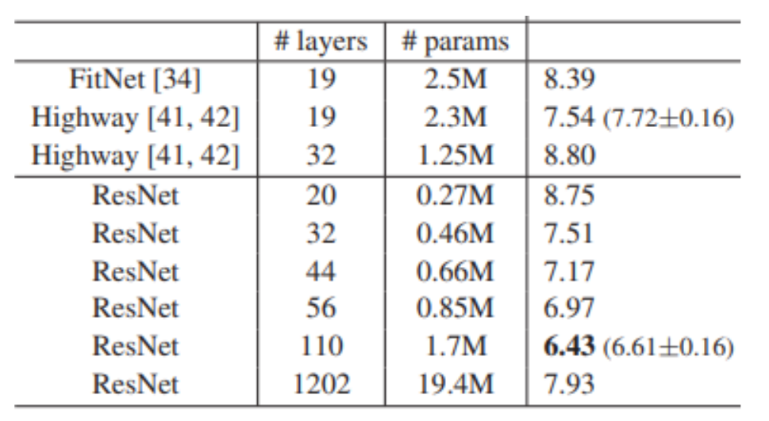

残差连接是一种常用的网络结构，它能够帮助深度神经网络更好地收敛，并减少梯度消失或爆炸的问题。残差连接的基本思想是，如果一个层的输出可以被其输入直接预测，那么就不要再加一层全连接层，而是直接将其输出作为下一层的输入。

下图为resnet-18结构图

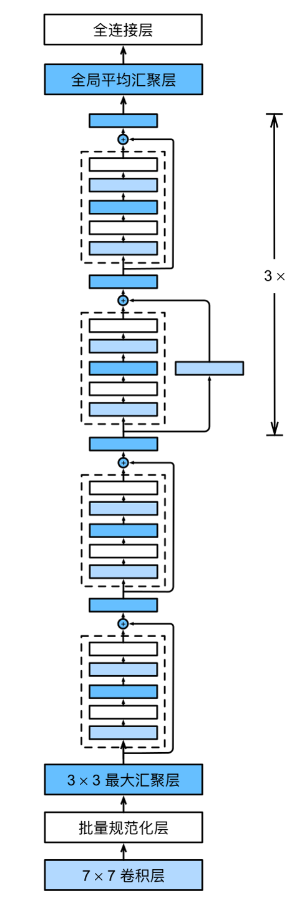


利用残差连接，你可以构建任意深度的神经网络，而无须担心梯度消失问题。

### 2.2.3 批量规范化

**规范化（normalization）**包含多种方法，旨在让机器学习模型看到的不同样本之间更加相似，这有助于模型学习，还有助于更好地泛化到新数据。

虽然原始论文指出，批量规范化的作用是“减少内部协变量偏移”，但没有人能真正确定批量规范化为何有效。有各种假说，但没有确定的说法。你会发现，深度学习中的许多事情是这样的——深度学习不是一门精确的科学，而是一组不断变化、根据经验得出的最佳工程实践，其中夹杂着不可靠的表述。

### 2.2.4 深度可分离卷积

如果我告诉你，有一种层可以替代 Conv2D 层，并可以让模型变得更加轻量（可训练权重参数更少）、更加精简（浮点运算更少），还可以将模型性能提高几个百分点，你觉得怎么样？我说的正是 深度可分离卷积（depthwise separable convolution）层的作用（Keras 中的
SeparableConv2D 层）。这种层对输入的每个通道分别进行空间卷积，然后通过逐点卷积（1×1 卷积）将输出通道混合。

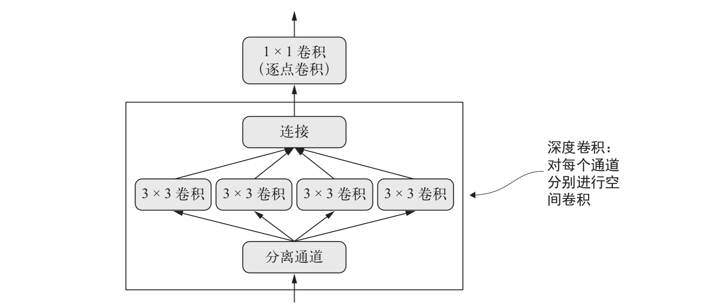

> 深度可分离卷积：深度卷积 + 逐点卷积

与普通卷积相比，深度可分离卷积的参数更少，计算量也更小，同时具有相似的表示能力。它得到的是更小的模型，其收敛速度更快，更不容易出现过拟合。如果只用有限的数据从头开始训练一个小模型，这些优点就变得尤为重要。

以GoogleNet为代表的深度神经网络架构，其卷积层都采用深度可分离卷积。

1. Inception块

   在GoogLeNet中，基本的卷积块被称为Inception块（Inception block）
   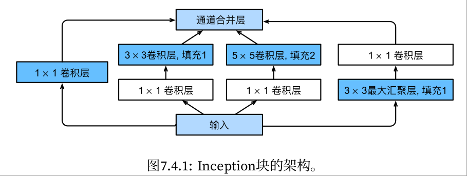

2. GoogLeNet
    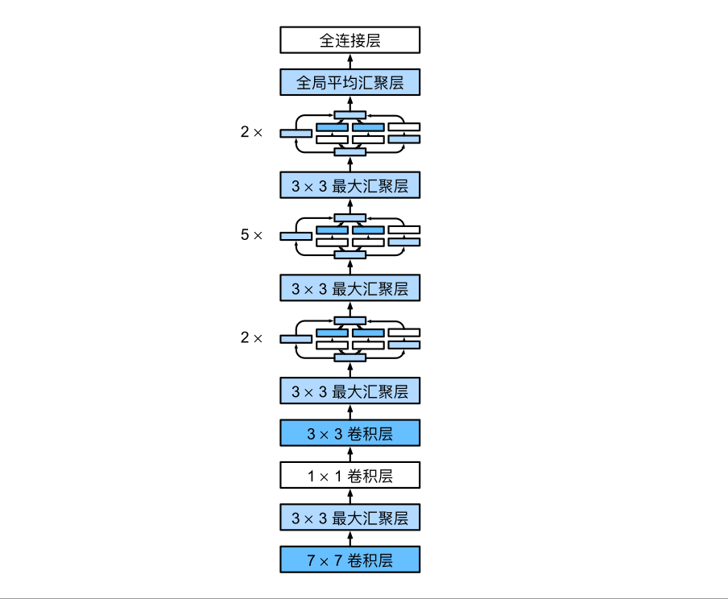
  
# 3. YOLOv5实战

[yolov5-5.0训练完整步骤](https://blog.csdn.net/m0_72845244/article/details/131508466?fromshare=blogdetail&sharetype=blogdetail&sharerId=131508466&sharerefer=PC&sharesource=m0_72845244&sharefrom=from_link)

# 4. 有关深度学习的社区

- [Kaggle](https://www.kaggle.com/)
- [HuggingFace](https://huggingface.co/)
- [Modelscope](https://modelscope.io/)
- [Github](https://github.com/)

---

# 作业

## 1. 使用C++部署手写数字识别的模型

训练过程随意，训练模型架构随意，可以使用MLP或LeNet-5。主要考验模型的部署和使用。

要求：

- 使用**C++**部署，模型转成**onnx格式**。
- 在Gitee中提交C++部署代码，以及输入一张图片运行的结果图。

截止日期：12月7日（周六）

## 2. YOLO动手操练(选做，可做可不做)

YOLO目标检测是每个RMer小白学习的必经之路，请同学们自学YOLOv5算法的部署，部署YOLOv5目标检测算法。

要求：

- 在自己电脑上配置好深度学习环境，要求使用**GPU推理**。
- 使用官方模型权重
- 在Gitee中提交随意一个推理视频

截止日期：12月7日（周六）