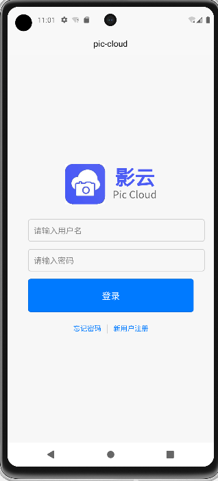
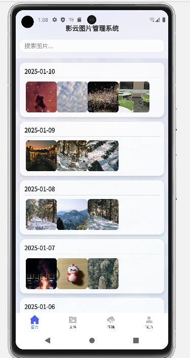
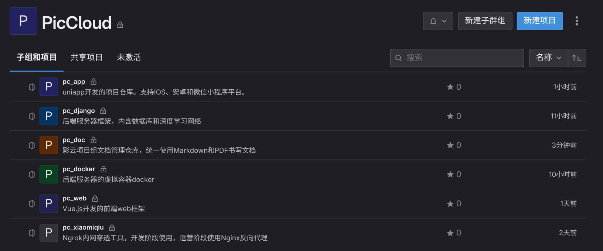
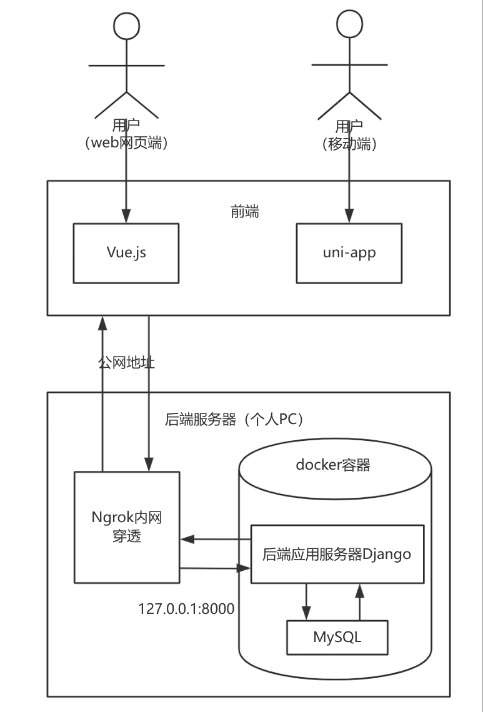
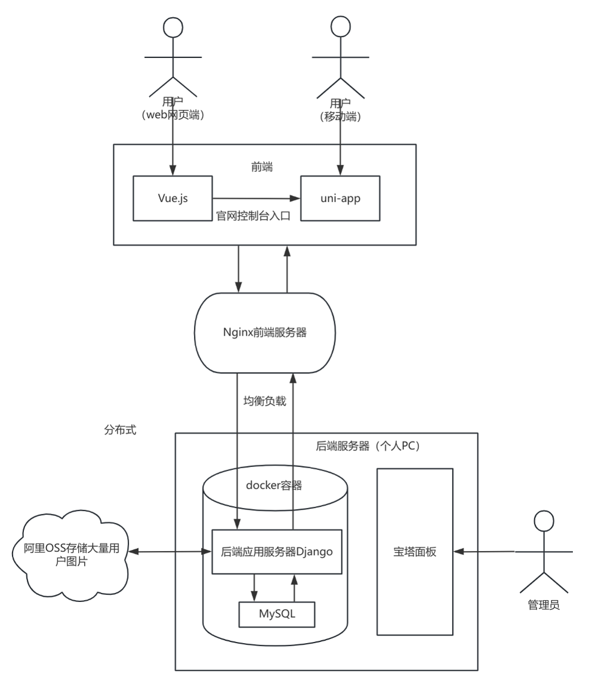

## 项目计划书概述

影云（PicCloud）项目旨在设计并实现一个综合图片管理系统，支持用户上传、管理、搜索和分析图片。项目设计包括前后端的功能需求、人员分工、技术栈和数据库设计等。以下是该项目的详细规划和技术方案。

---

### 项目功能性需求

1. **用户管理**：包括用户注册、登录、身份认证与权限控制。
2. **图片上传与查看**：支持从移动端和PC端上传图片，支持图片查看、裁剪、旋转等操作。
3. **图片搜索**：提供多维度的图片搜索功能，如基于时间、地理位置和标签等。
4. **图片内容过滤**：自动检测和删除不符合规定的图片。
5. **图片分类管理**：支持文件夹、标签及多级目录结构，便于用户整理图片。
6. **智能命名与批量重命名**：支持智能命名规则和批量重命名功能。
7. **图像元数据管理**：存储并展示图片的EXIF数据，如拍摄日期和相机型号等。

---

### 项目非功能性需求

1. **PC端**：界面美观，兼容主流浏览器，并适应不同分辨率，支持第三方接口和数据可视化。
2. **移动端**：兼容安卓、小程序和iOS，支持扫码、定位等功能，且适配不同设备。
3. **服务器**：提供高并发的后端接口，支持性能监控、定时任务、AI接入等功能。部署在Docker环境中。
4. **数据库**：符合相关规范，实现存储过程和游标等功能。
5. **代码规范**：所有代码、数据库备份等需通过Git管理，并遵循严格的代码规范。

---

### 人员分工

- **前端**：
  - **手机端**：唐嘉俊、施志鸿
  - **Web端**：李星呈
- **后端**：
  - **数据库**：张行、李灿
  - **AI**：蔡明辰

> 项目成员应互相提意见，共同推进进度。

---

### 项目整体进度规划

- **初期（这三天）**：测试方案的可行性和流程。
- **年前**：完成基础功能模块的开发。
- **年后**：完善功能和进行系统优化。

#### 目前进度

> ~~新建文件夹中，约等于0~~🥲

1. 前端
  - 完成了前端原型设计的1/3
  
    

  - 学习Vue.js
  
1. 后端
  - 有初步的dockerfile，初步docker环境配置完成。
  - 测试yolo，llama的AI本地部署
  - 后端已完成Django项目的原型设计，在ubuntu的docker部署成功。
  - 学习Django

2. 文档

  - 需求文档、设计文档、接口文档：正在不紧不慢不快不慢地写🤡

#### 后续规划

1. 年前
  
  - 前端
    - [ ] 项目官网设计
    - [ ] app程序实现登录、注册、图片上传等基本功能
    - [ ] app对接后端API接口

  - 后端
    - [x] 制造docker环境
    - [x] Ngrok内网穿透
    - [ ] 阿里云OSS对象存储
    - [ ] 创建MySQL table
    - [ ] API接口设计
    - [ ] AI的图片检索、分类、语义理解的单元模块
    - [ ] 付款单元模块
    - [ ] 支持多设备图片互传
    
    
2. 年后

  - 前端 
    - [ ] 官网部署netlify
    - [ ] app UI 与 细节(如系统语言、系统通知)优化
    - [ ] 网页端应用的调整制作
    - [ ] Nginx前端服务器部署
    - [ ] 支持NAS私有云
    
  - 后端
    - [ ] 后端单元模块写入Django
    - [ ] 后端服务器上云，分布式部署
    - [ ] 拓展高级AI功能
    - [ ] 视频存储与管理
    - [ ] 运营面板
    
---

### GitLab 管理

- **任务分配**：使用GitLab待办事项功能，将任务分配给各个成员。
- **main分支**：为主分支，所有成员为Maintainer，可直接推送代码。如没有信心直接push代码到main分支，可先创建dev分支进行测试。
- **发布版本**：由于GitLab没有release功能，版本发布需要手动创建tag并推送。

- **代码仓库**： 
  
  

- **代码规范**: [【Python】编程规范与风格指南（Google Python Style Guide）](https://blog.csdn.net/qq_42951560/article/details/124738591)
---

### 项目架构设计

#### 前后端分离架构

(不代表最终方案)

| 年前                       | 年后                          |
| --------------------------------- | ---------------------------------- |
|              |              |

#### 前端

前端开发使用**Uniapp**（支持多端），通过Vue.js构建Web端，确保在移动端和PC端的兼容性。

- **App端**：Uniapp至少要发布出安卓和iOS版本，并适配不同大小设备。
- **Web端**：两部分：
  - **官网Web**：基于Vue.js，展示产品介绍等信息。
  - **产品Web**：用Uniapp开发，适配不同设备。

#### 后端

1. **Django框架**：
   - Python版本：3.10.12。
   - 方便快速开发，且易于与AI模块对接。
   - 环境配置简单，支持RESTful API接口。

2. **数据库**：
   - 使用MySQL数据库，支持高并发。
   - 图片存储在本地硬盘上（后期OSS存储），数据库仅保存图片URL。

3. **服务器**：
   - 使用Ubuntu 2204系统，建议使用双系统而非虚拟机。
   - 开发IDE推荐使用VS Code，确保不同人员协作。

---

### 不详细的功能设计

#### 1. 用户管理（accounts）
- **功能**：注册、登录、身份认证、权限控制等。
- **用户角色**：普通用户。
  
#### 2. 图片管理（images）
- **功能**：图片上传、查看、删除、分类、元数据管理等。
- **分类方式**：通过文件夹、标签、多级目录组织图片。

#### 3. 图片搜索（search）
- **功能**：支持按时间、地理位置、标签等条件搜索图片。

#### 4. AI 图像识别（ai）
- **功能**：自动识别图片内容、生成标签、分类图片、AI图像增强等。
- **技术**：采用YOLO、CNN模型，使用深度学习进行图像内容分析。

#### 5. API接口（api）
- **功能**：为前端提供各种数据交互接口，如用户认证、图片管理、AI识别等。

#### 6. 通知管理（notifications）
- **功能**：推送通知、消息提醒、系统通知等。

#### 7. 后台管理系统（admin）
- **功能**：管理员管理用户、图片、通知、权限等，生成统计数据。

---

### AI功能与优化

1. **图像识别与分类**：
   - 使用YOLO或CNN进行图片内容分类。
   - 按上传时间、标签等智能命名图片。

2. **图像相似度搜索**：
   - 使用SSIM（结构相似性）或CLIP进行图像内容理解和搜索。

3. **图像增强与美颜**：
   - 采用AI插值算法提高图像分辨率。
   - 使用Stable Diffusion等模型进行图像风格转化。

---

### 数据库设计

使用MySQL数据库。

- **用户(users)**：uid、用户名、密码、邮箱、头像、注册时间、会员权限等。
- **图片(photos)**：uid、图片URL、上传时间、标签、AI描述、地理位置等。
- **标签(tags)**：标签名、uid等。
- **标签与图片关联表(tags-photos)**：**：标签名、uid等。

---

### 项目安全与部署

- **Docker**：项目部署在Docker环境中，确保容器化管理和轻松迁移。
- **安全性**：提供身份认证、权限管理和数据加密，确保用户数据安全。

---

### 其他功能

#### 充值系统
用户可以选择不同存储套餐，免费用户限制1GB存储，普通会员和超级会员可以获得更大的存储空间以及更多的AI功能支持。

#### 用户私有云与视频存储
作为后续功能，可考虑实现用户私有云存储，支持视频存储和管理。

#### 运营面板（Dashboard）
使用宝塔面板进行系统监控，查看数据库、服务器性能等。

#### OSS存储（阿里云）
使用阿里云OSS进行对象存储，免费版本支持20GB存储，适用于初期使用。

---
